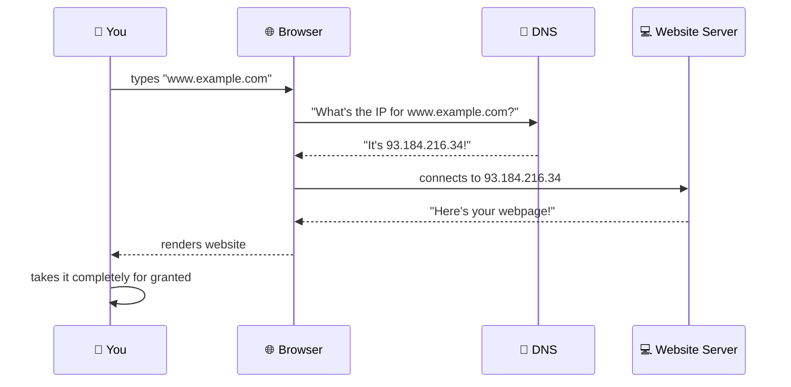

# Chapter 1: What Even Is DNS?

> *"It's not DNS."*
> *"It can't be DNS."*
> *"It was DNS."*
> — Ancient SysAdmin Proverb, circa every incident ever

---

## 1.1 A Brief History of Not Knowing Where Things Are

Long ago, in the dark ages of the early internet (the 1980s), computers communicated with each other using IP addresses. An IP address looks like `192.168.1.1` — a series of numbers that is completely unmemorable and impossible to type correctly on the first try.

Back then, every computer on the internet kept a file called `HOSTS.TXT`. This file was maintained by the Stanford Research Institute, and you had to **download a new copy periodically** to know about new computers on the network. As you can imagine, this scaled about as well as a paper map scales to navigating a city that rearranges itself every Tuesday.

The network grew. The `HOSTS.TXT` file grew. People started losing their minds.

And then, in 1983, Paul Mockapetris (yes, that is his real name, and yes, he is a hero) invented DNS — the **Domain Name System** — and saved humanity from having to memorize IP addresses.

He is largely unappreciated. This book is partially a tribute to him.

---

## 1.2 The Core Concept (Explained Simply, Then Less Simply)

DNS is, at its heart, a **phone book**.

Remember phone books? Those enormous paper bricks that showed up on your doorstep and went directly into the recycling bin? DNS is like that, except:

1. It's distributed across thousands of servers worldwide
2. It updates (eventually — we'll get to this)
3. It is responsible for approximately 90% of all production outages
4. Nobody truly understands all of it

When you type `www.example.com` into your browser, your computer has no idea what that means. It knows IP addresses. It does not know "example dot com." So it asks DNS: *"Hey, what's the IP address for www.example.com?"* DNS responds with something like `93.184.216.34`, and your browser goes "great, thanks!" and connects.

This process happens **billions of times per second** across the globe, and it works so seamlessly that most people have no idea it exists — right up until it breaks.

---

## 1.3 Why Should You Care?

You should care about DNS because DNS is the reason:

- Your website migration "didn't work" even though you updated everything
- Your email stopped delivering even though the server was fine
- Your colleague insists the site is down while you can load it fine
- Your on-call alert fired at 3am for something that was "already fixed"
- Your new subdomain won't resolve despite being set up "correctly"

DNS is invisible when it works and catastrophic when it doesn't. Understanding it is the difference between a 5-minute fix and a 4-hour incident involving three engineers, two Slack channels, and a panicked call to your registrar's support line.

> **The DNS Paradox:** The more invisible a technology is, the more important it is to understand it. DNS is the most invisible critical infrastructure in the world.

---

## 1.4 DNS in One Sentence

If you need to explain DNS to a non-technical person in one sentence:

> "DNS is a global address book that converts human-readable website names into computer-readable numbers."

If you need to explain it to a technical person who thinks they already know everything:

> "DNS is a hierarchical, distributed, eventually-consistent database with a caching layer that is the root cause of approximately half of all production incidents, a system so fundamental that if it breaks nothing else can work, and yet it is somehow still running primarily on software written in the 1980s."

Both are correct. The second one just has more dramatic flair, which it has earned.

---

## 1.5 The Meme That Started This Book

Let's address the elephant in the room, or rather, the joke in the introduction:

> "Guys, guys! I have a DNS joke for you! But be advised, it could take up to 24 hours for everyone to get it."

This joke is funny (if you work in tech) because of **DNS propagation**. When you make a change to a DNS record, that change doesn't instantly appear everywhere on the internet. Depending on your TTL settings (more on TTL in Chapter 4), it can take anywhere from a few minutes to 48 hours for the change to "propagate" — that is, for all the caches and servers around the world to stop serving the old information and start serving the new information.

The joke is a pun on "getting" a joke (understanding it) and DNS "getting" the update (propagating the change). It's simultaneously the nerdiest and most accurate joke about DNS ever written.

It also explains why, when you change your DNS records and then ask your colleague "can you see the new site?", they might say "no" even though you can. You're seeing the cached old record. They're seeing the cached new record. Or vice versa. Welcome to DNS propagation hell. We have t-shirts. (They haven't propagated yet.)

---

## 1.6 What This Book Will Teach You

By the end of this book, you will understand:

- How DNS actually works, from your browser all the way to the authoritative nameserver
- What TTL is, why it matters, and how to set it correctly (and what happens when you don't)
- The different types of DNS records and what they're for
- How DNS works (and breaks) in Kubernetes environments
- How to debug DNS problems like a pro
- Why it is, in fact, always DNS

You will also have been exposed to an unreasonable number of DNS memes, which is a side effect that the author makes no apologies for.

Let's begin.

---

*Next: [Chapter 2 — The DNS Hierarchy: Turtles All the Way Down](02-dns-hierarchy.md)*
