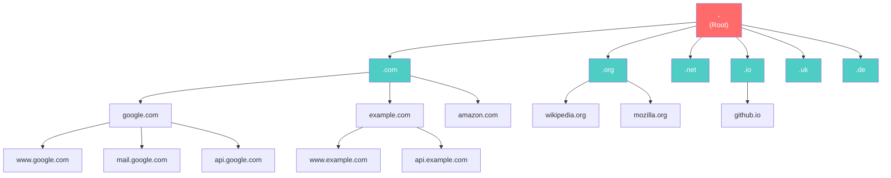
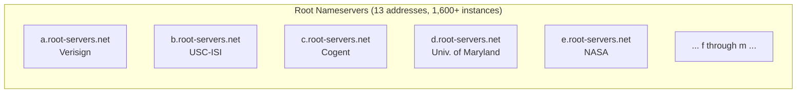
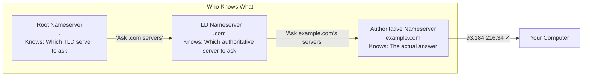
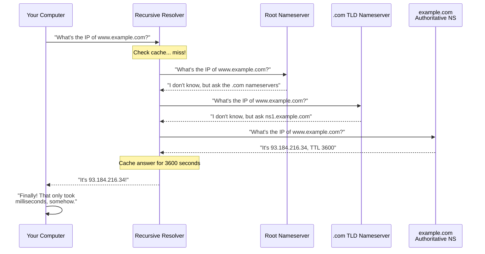
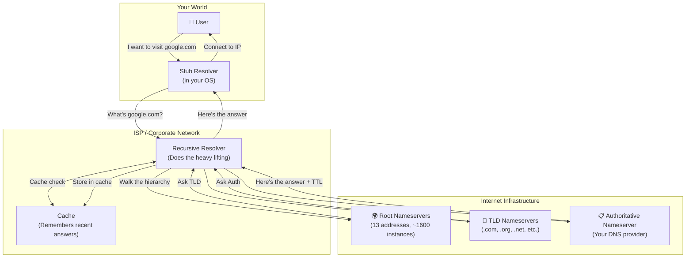

# Chapter 2: The DNS Hierarchy — Turtles All the Way Down

> *"It's turtles all the way down."*
> — Someone who clearly worked in DNS

---

## 2.1 The Problem With "Global" Anything

Imagine you need to create a single global address book for the entire internet. Every website, every server, every email host, every service — all in one place, instantly queryable, always up-to-date.

You can't. It's impossible. The internet has over **350 million registered domain names** and serves **billions of queries per second**. No single server could handle this. No single organization should control it. No single database could store it all and stay consistent.

This is the fundamental design challenge that DNS solves, and it solves it with a brilliant hierarchical structure that distributes both the storage and the load across the entire planet.

The price of this distributed brilliance, of course, is eventual consistency. But we'll deal with that in Chapter 6.

---

## 2.2 The Hierarchy Explained

DNS is organized as an inverted tree. At the very top is the **root**, represented by a single dot (`.`). Beneath the root are the **Top-Level Domains (TLDs)**, like `.com`, `.org`, `.net`, `.io`, and `.uk`. Beneath those are **second-level domains** like `example.com`, `google.com`, and `yourcompany.io`. And beneath those are **subdomains** like `www.example.com`, `api.example.com`, and `mail.example.com`.



Each level of this hierarchy is managed by different entities:

| Level | Example | Managed By |
|-------|---------|------------|
| Root (`.`) | `.` | IANA / Root Server Operators |
| TLD | `.com`, `.org` | ICANN-delegated registries (Verisign for .com) |
| Second-level domain | `example.com` | Domain registrars / domain owners |
| Subdomain | `www.example.com` | Domain owners |

---

## 2.3 The Root Zone — The Foundation of Everything

At the very top of the DNS hierarchy are the **root nameservers**. There are 13 root nameserver *addresses* (named A through M), managed by 12 different organizations including ICANN, NASA, the US Army, and Verisign.

Wait, only 13? For the entire internet?

Yes. And no. The "13" is actually 13 IP addresses (well, 13 IPv4 addresses). But thanks to a technology called **anycast**, each of those 13 addresses is served by hundreds of physical servers distributed around the globe. In reality, there are over **1,600 root server instances** worldwide.



The root nameservers don't know where `www.example.com` is. What they **do** know is who to ask next: the TLD nameservers.

> **Root Zone Fun Fact:** The list of root nameservers is hardcoded into every recursive resolver on the internet. This list, called the "root hints file," hasn't needed to change since 1997. DNS was overengineered in the best possible way.

---

## 2.4 TLD Nameservers — The Middle Management of the Internet

Top-Level Domain nameservers are responsible for storing information about all domains registered under their TLD. Verisign, for example, runs the nameservers for `.com` and `.net`, handling roughly **200 billion DNS queries per day**.

When you register `example.com` with a registrar like Namecheap or GoDaddy, the registrar tells Verisign's TLD nameservers: "Hey, this domain is registered, and here are its nameservers."

TLD nameservers don't know the actual IP address of `www.example.com` either. They just know *who does* know — the authoritative nameservers for that domain.

---

## 2.5 Authoritative Nameservers — The Buck Stops Here

The **authoritative nameserver** for a domain is where the actual DNS records live. This is the server that will give you the definitive, authoritative answer to "what is the IP address of www.example.com?"

Your authoritative nameserver is usually one of:
- Provided by your domain registrar (e.g., Namecheap DNS)
- A managed DNS service (Cloudflare, AWS Route 53, Google Cloud DNS)
- A nameserver you self-host (brave choice)

When you "update your DNS records," you are updating records on your authoritative nameserver. This is the source of truth.



---

## 2.6 Recursive Resolvers — The Hired Investigators

When your browser wants to know the IP address of `www.example.com`, it doesn't talk to the root nameservers directly. Instead, it talks to a **recursive resolver** — also called a recursive nameserver, a caching resolver, or sometimes confusingly, "DNS server."

The recursive resolver is a server that does all the dirty work: it walks the DNS hierarchy from top to bottom, caching results along the way, to get you the answer you need.

Your recursive resolver is typically:
- Provided by your ISP (often terrible, slow, and tracking your queries)
- Google's public DNS: `8.8.8.8` and `8.8.4.4`
- Cloudflare's public DNS: `1.1.1.1` and `1.0.0.1`
- Your corporate DNS server
- A resolver running inside your Kubernetes cluster (more on this later)



---

## 2.7 The Caching Layer — Why Everything Is Eventually Consistent

At every step in this process, servers **cache** the answers they receive. Caching is what makes DNS fast: instead of walking the entire hierarchy for every single query, resolvers remember recent answers and serve them directly.

But caching is also what makes DNS changes **slow to propagate**. When you update a DNS record, every resolver that has cached the old record will keep serving the old answer until the cache expires.

How long does a cache live? That depends on the **TTL** — the Time To Live value attached to every DNS record.

We will spend all of Chapter 4 on TTL. And Chapter 6. And honestly, parts of every other chapter too, because TTL is that important.

---

## 2.8 The Full Picture

Let's put it all together with a comprehensive view of the DNS hierarchy and the roles within it:



---

## 2.9 The HOSTS File — A Ghost of Christmas Past

Remember `HOSTS.TXT` from Section 1.1? Its descendant still haunts our computers today. Most operating systems have a local `hosts` file (at `/etc/hosts` on Linux/Mac, at `C:\Windows\System32\drivers\etc\hosts` on Windows) that is checked **before** DNS.

```
# /etc/hosts
127.0.0.1       localhost
::1             localhost
192.168.1.100   my-dev-machine
```

The `hosts` file is checked first and overrides DNS. This is incredibly useful for development and incredibly annoying when you forget you added an entry six months ago and can't figure out why DNS "isn't working."

> **True Story:** A developer once spent three hours debugging a DNS issue before discovering they had added their production server's IP to their local `hosts` file during a previous incident. They had since migrated to a different IP. DNS was fine. Their `hosts` file was a time capsule of bad decisions.

---

*Next: [Chapter 3 — DNS Record Types: A Zoo of Confusion](03-dns-record-types.md)*
