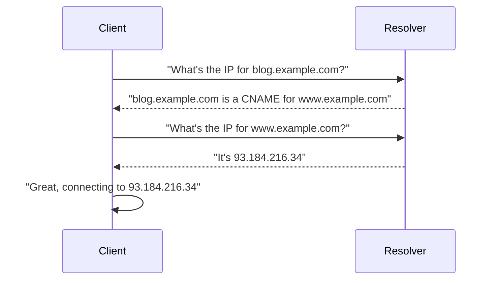
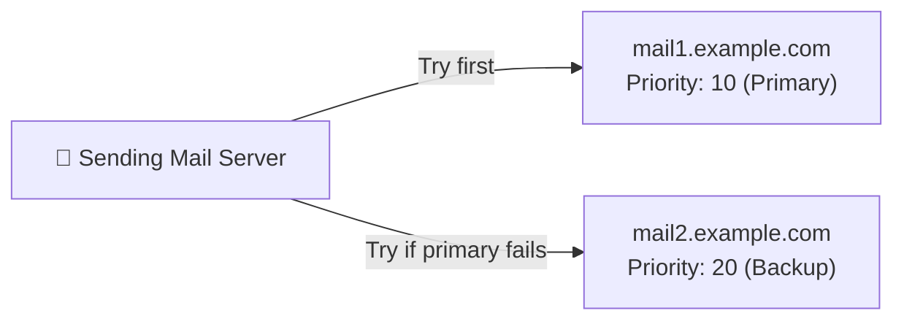
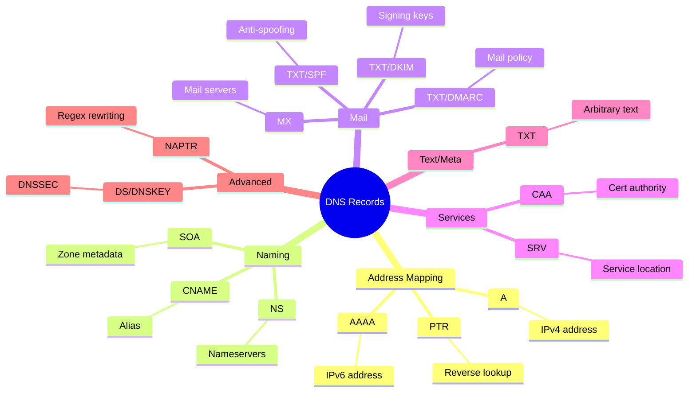

# Chapter 3: DNS Record Types — A Zoo of Confusion

> *"There are only two hard things in Computer Science: cache invalidation, naming things, and DNS record types."*
> — Phil Karlton (paraphrased and extended)

---

## 3.1 Welcome to the Menagerie

DNS doesn't just store IP addresses. Over its 40-year lifetime, it has accumulated a staggering variety of record types, each storing different kinds of information. Some are critical. Some are useful. Some were clearly designed at 3am by someone who had consumed too much coffee and had a very specific problem to solve.

Let's meet them all.

---

## 3.2 The A Record — The One That Started It All

The **A record** (Address record) maps a hostname to an **IPv4 address**. This is the most fundamental DNS record type, the one that does the core job of "turn this name into an IP address."

```
www.example.com.    3600    IN    A    93.184.216.34
```

Breaking this down:
- `www.example.com.` — the name (note the trailing dot — more on this later)
- `3600` — the TTL in seconds (1 hour)
- `IN` — the class (Internet — always IN; the other classes are forgotten relics)
- `A` — the record type
- `93.184.216.34` — the IPv4 address

You can have multiple A records for the same name, which enables simple round-robin load balancing:

```
www.example.com.    60    IN    A    93.184.216.34
www.example.com.    60    IN    A    93.184.216.35
www.example.com.    60    IN    A    93.184.216.36
```

Clients will typically use one of these addresses, cycling through them. It's the world's simplest load balancer, and it has the world's simplest failure mode: if one server goes down, clients that get that IP will fail, and there's no health checking whatsoever.

---

## 3.3 The AAAA Record — Because IPv6 Has Four Times as Many Bits

The **AAAA record** (Quad-A record) is to IPv6 what the A record is to IPv4. It maps a hostname to an IPv6 address.

```
www.example.com.    3600    IN    AAAA    2606:2800:220:1:248:1893:25c8:1946
```

IPv6 addresses look like someone fell asleep on their keyboard, but they're necessary because we've run out of IPv4 addresses. The internet has been "running out of IPv4 addresses" since approximately 2011, and yet here we are, still using them through increasingly creative use of NAT (Network Address Translation).

The AAAA name comes from the fact that IPv6 addresses are 128 bits — four times the size of IPv4's 32 bits. Four A's for four times. DNS record naming is occasionally logical.

---

## 3.4 The CNAME Record — The Alias

The **CNAME record** (Canonical Name record) creates an alias from one name to another. Instead of pointing to an IP address, it points to another hostname.

```
blog.example.com.    3600    IN    CNAME    www.example.com.
```

This means "blog.example.com is really www.example.com." When a resolver looks up `blog.example.com`, it gets redirected to `www.example.com` and then looks *that* up to get the final IP address.



CNAMEs have rules. Important rules. Rules that people break constantly:

1. **A CNAME cannot coexist with other records for the same name.** You can't have a CNAME and an A record for the same hostname. This is why you can't put a CNAME on your root/apex domain (like `example.com` itself) — because you also need SOA and NS records there.

2. **CNAME chains are legal but evil.** `a.example.com -> b.example.com -> c.example.com -> d.example.com` is technically valid DNS but adds lookup overhead and makes debugging a nightmare. Don't do this.

3. **Never CNAME to a CNAME that you don't control.** If the external CNAME disappears, your domain is broken and you have no control over fixing it.

> **The CNAME at the Root Zone Problem:**
> You want `example.com` (no www) to point to your CDN, which gives you a hostname like `d1234.cloudfront.net` instead of a stable IP. But you can't put a CNAME on `example.com` because it's the root! What do you do?
>
> Many DNS providers have invented proprietary workarounds for this: Cloudflare calls theirs **CNAME Flattening**, AWS Route 53 calls it **ALIAS records**, and others have **ANAME records**. These all work by returning A records instead of CNAME records, resolving the chain behind the scenes. None of them are standardized. Welcome to DNS.

---

## 3.5 The MX Record — Mail Never Works Either

The **MX record** (Mail Exchange record) tells the world where to send email for your domain.

```
example.com.    3600    IN    MX    10    mail1.example.com.
example.com.    3600    IN    MX    20    mail2.example.com.
```

The number before the mail server hostname is the **priority** (lower number = higher priority). If `mail1.example.com` is unavailable, senders will try `mail2.example.com`.



**Critical MX Record Gotcha:** MX records must point to A or AAAA records — never to CNAME records. This is in the RFC and violating it will cause email delivery issues that are incredibly difficult to debug. Email servers are already mysterious enough without adding DNS weirdness to the mix.

> **Real World Incident:** A company migrated their mail hosting and set their MX record to point to a CNAME. Email "mostly worked" for several weeks — enough to not notice immediately — until some mail servers started rejecting delivery with cryptic errors. The incident involved three engineers, a Google search history full of RFC numbers, and a very tense call with their email provider. The fix was changing the MX to point directly to the A record. Total downtime: ~3 weeks of degraded email delivery that nobody fully noticed until it was fixed.

---

## 3.6 The TXT Record — Notes to Yourself and the Internet

The **TXT record** (Text record) stores arbitrary text data. Its original purpose was vague ("human-readable information"), and it has since been repurposed for approximately everything.

```
example.com.    3600    IN    TXT    "v=spf1 include:_spf.google.com ~all"
example.com.    3600    IN    TXT    "google-site-verification=abc123xyz..."
example.com.    3600    IN    TXT    "Hello, I put this here in 2019 and forgot about it"
```

Common uses for TXT records:

| Use Case | Example |
|----------|---------|
| **SPF** | Email anti-spoofing (`v=spf1 include:...`) |
| **DKIM** | Email cryptographic signing keys |
| **DMARC** | Email policy enforcement |
| **Domain verification** | Prove you own a domain to Google/Microsoft/etc |
| **ACME challenges** | Let's Encrypt certificate validation |
| **Random notes** | Things that probably belong in a README |

TXT records are the junk drawer of DNS. Peek at the TXT records of any domain that's been around for a decade and you'll find a fascinating archaeological dig of every service they've ever integrated with, some defunct verification tokens, and at least one record nobody can explain.

```bash
$ dig TXT example.com
# Returns: multiple TXT records, some from 2012 that nobody will ever delete
```

---

## 3.7 The NS Record — Who's In Charge Here?

The **NS record** (Nameserver record) specifies which nameservers are authoritative for a domain.

```
example.com.    172800    IN    NS    ns1.nameserverprovider.com.
example.com.    172800    IN    NS    ns2.nameserverprovider.com.
```

When you "point your domain to Cloudflare" or "change your nameservers," you're updating the NS records. This is one of the slowest DNS changes to propagate because TLD servers cache NS records aggressively (notice the large TTL: 172800 seconds = 2 days).

**You should have at least two NS records** — one isn't enough for redundancy. Having 4-6 is common for serious deployments. The number of nameservers required to be down before your entire domain stops resolving is exactly (total NS records - 1), so more is better.

---

## 3.8 The SOA Record — The Birth Certificate

The **SOA record** (Start of Authority) is a required record that contains administrative information about a DNS zone. Every zone has exactly one SOA record.

```
example.com.    3600    IN    SOA    ns1.example.com. admin.example.com. (
    2024031501  ; Serial number
    7200        ; Refresh (secondary nameserver refresh interval)
    900         ; Retry (if refresh fails, wait this long before retry)
    1209600     ; Expire (stop serving zone after this many seconds without update)
    300         ; Minimum TTL (negative caching TTL)
)
```

The serial number is important for secondary nameservers — they compare their serial to the primary's serial to know if they need to refresh their data. The convention is to use a date-based format like `YYYYMMDDNN` (year, month, day, sequence number), though technically any monotonically increasing number works.

> **The Forgotten SOA Serial Problem:** You update your DNS records but forget to increment the SOA serial. Your secondary nameservers check, see the same serial number, and refuse to update. Your changes appear on the primary nameserver but nowhere else. You spend 45 minutes debugging before someone asks "did you increment the serial?" and you have to answer "...no."

---

## 3.9 The SRV Record — Services, Formalized

The **SRV record** (Service record) specifies location information for services. It's used by various protocols (SIP, XMPP, etc.) to locate services without hardcoding hostnames.

```
_service._proto.name.   TTL   class   SRV   priority   weight   port   target
_http._tcp.example.com. 3600  IN      SRV   10         5        80     www.example.com.
```

SRV records include priority, weight (for load distribution), and port. They're brilliant in theory and used far less than they should be in practice, because most developers hardcode the port anyway.

Kubernetes uses SRV records for service discovery internally — we'll see this in Chapter 9.

---

## 3.10 The PTR Record — Reverse DNS (The Map's Evil Twin)

The **PTR record** (Pointer record) does the opposite of an A record: it maps an IP address to a hostname. This is called **reverse DNS lookup** or **rDNS**.

```
34.216.184.93.in-addr.arpa.    3600    IN    PTR    www.example.com.
```

Reverse DNS zones are organized under the special `.in-addr.arpa` domain (note the reversed IP octets — `93.184.216.34` becomes `34.216.184.93`). For IPv6, the domain is `.ip6.arpa`.

PTR records are used by:
- Email servers (to verify sending server identity — missing PTR = spam score goes up)
- Logging and monitoring (turning IPs back into hostnames for readability)
- Security tools (network forensics, intrusion detection)
- Your own curiosity (`host 8.8.8.8` → `dns.google`)

You don't control PTR records for your IP address directly — the IP block owner (usually your hosting provider or ISP) controls the reverse DNS zone. You have to ask them to set it.

---

## 3.11 The CAA Record — Certificate Authority Authorization

The **CAA record** (Certification Authority Authorization) specifies which Certificate Authorities are allowed to issue SSL/TLS certificates for your domain.

```
example.com.    3600    IN    CAA    0    issue    "letsencrypt.org"
example.com.    3600    IN    CAA    0    issuewild "letsencrypt.org"
example.com.    3600    IN    CAA    0    iodef    "mailto:security@example.com"
```

This is a relatively new record type (2017) that helps prevent certificate misissuance. If a CAA record exists, CAs are required to check it before issuing a certificate. If your CAA says "only Let's Encrypt," then DigiCert (for example) should refuse to issue you a cert — even if someone socially engineers their way through DigiCert's validation process.

---

## 3.12 The NAPTR Record — For When You've Run Out of Normal Solutions

The **NAPTR record** (Naming Authority Pointer) is for when you have a very specific problem that can't be solved by any of the above record types. It supports regular expression-based rewriting of names. It is complex, rarely used, and best encountered only in VOIP routing systems and DNS documentation written by people who enjoy suffering.

We will not discuss it further.

---

## 3.13 Complete Record Type Reference



---

## 3.14 Which Record Types Will You Actually Use?

If you're running a typical web application, here's what you'll actually encounter:

**Daily:** A, AAAA, CNAME
**Regularly:** MX, TXT, NS
**Occasionally:** SOA, SRV, CAA
**Rarely:** PTR (you'll need it for email), NAPTR (pray you don't)
**In Kubernetes:** A, AAAA, SRV, PTR (internal cluster DNS does all of these automatically and we'll explain how in Chapter 9)

---

*Next: [Chapter 4 — TTL: Time To Live (Or: Why Your Cache Is Lying To You)](04-ttl.md)*
