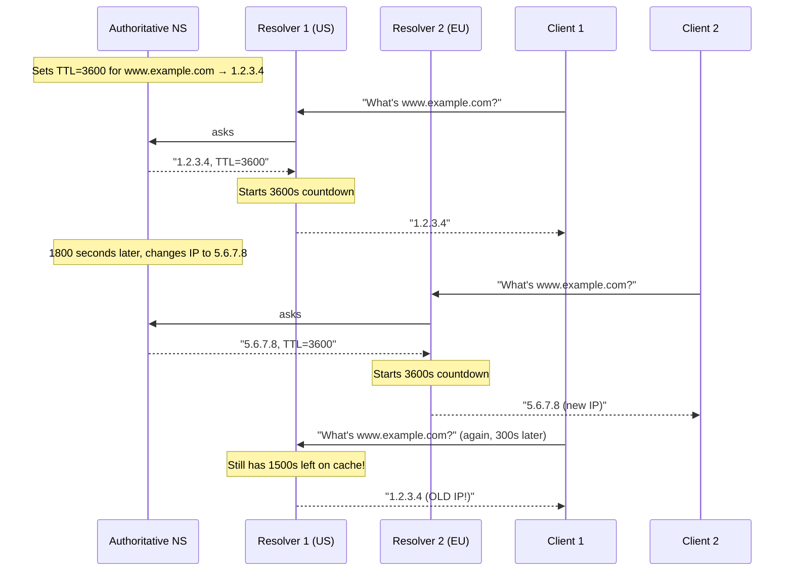
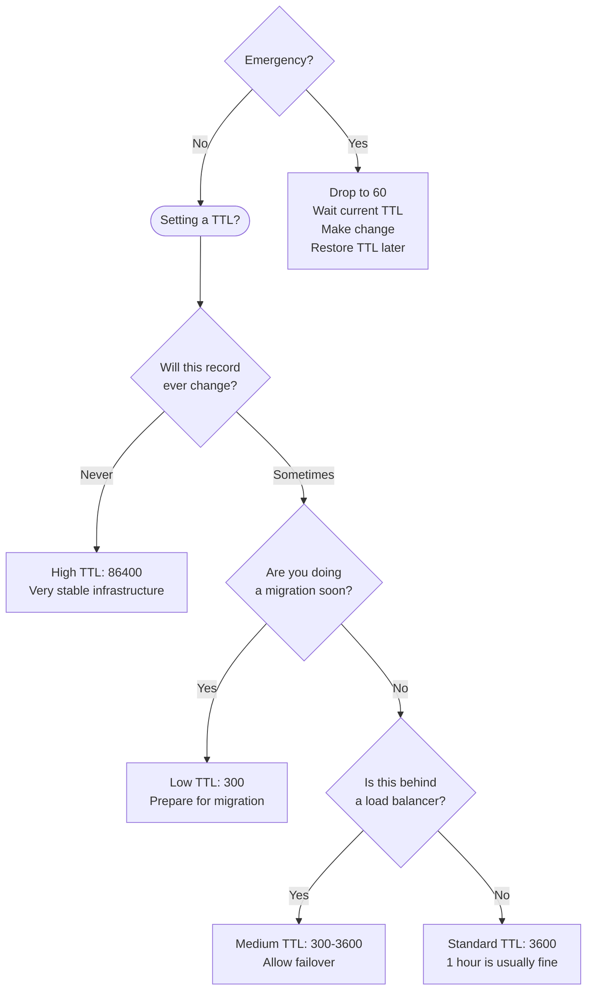
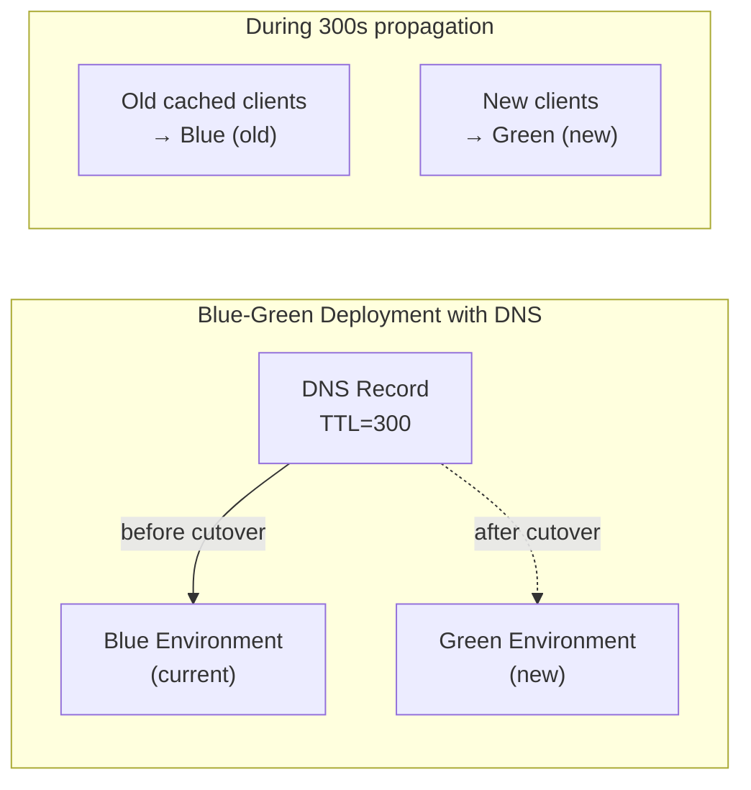

# Chapter 4: TTL — Time To Live (Or: Why Your Cache Is Lying To You)

> *"The road to production hell is paved with TTL values of 86400."*
> — Every SRE Who Has Ever Done a DNS Migration

---

## 4.1 What Is TTL?

**TTL** stands for **Time To Live**. It is a number, measured in seconds, attached to every DNS record. It tells caching resolvers: "cache this answer for this many seconds, then throw it away and ask again."

```
www.example.com.    3600    IN    A    93.184.216.34
                    ^^^^
                    This is the TTL: 3600 seconds = 1 hour
```

TTL is the answer to the question: "How long should this information be trusted before checking for updates?"

Set it too high: changes take forever to propagate and you're stuck waiting for caches to expire during incidents.
Set it too low: your DNS servers get hammered with queries and your latency goes up.
Set it just right: congratulations, you've achieved DNS zen. The three bears of internet infrastructure.

---

## 4.2 TTL in Practice — The Caching Chain

Here's the crucial thing that most people miss: **TTL is respected at every cache in the chain**, and each cache counts down independently from the moment it cached the value.



This is why "I changed my DNS and it works for me but not for my colleague." You're hitting different resolvers with different cache states. Your colleague isn't wrong. You're not wrong. DNS propagation is just... happening, slowly, across a distributed system, like a rumor spreading through a large office.

---

## 4.3 Common TTL Values and What They Mean

| TTL | Seconds | Common Use Case |
|-----|---------|-----------------|
| 0 | 0 | Do not cache (use sparingly — it's extremely aggressive) |
| 1 minute | 60 | Active incident, during rapid DNS changes |
| 5 minutes | 300 | Dynamic services, load balancers, health-check-driven failover |
| 15 minutes | 900 | Reasonably dynamic services |
| 1 hour | 3600 | Standard web servers |
| 1 day | 86400 | Very stable infrastructure (usually too high) |
| 2 days | 172800 | NS records, SOA records |
| 1 week | 604800 | Static infrastructure (almost never appropriate) |

The "standard" recommendation is **1 hour (3600 seconds)** for most records. But the real answer, as with most things in infrastructure, is "it depends."

---

## 4.4 The TTL Decision Framework

When choosing a TTL, ask yourself these questions:



---

## 4.5 The Pre-Migration TTL Dance

This is one of the most important things in this entire book. Pay attention.

**When you plan to change a DNS record, you must lower the TTL *before* making the change.**

Here's why: if your current TTL is 86400 (1 day) and you change your IP address, it can take up to 24 hours for all caches to expire and start serving the new IP. During those 24 hours, you may have traffic going to both the old and new IPs.

The correct migration procedure:

```mermaid
gantt
    title DNS Migration Timeline
    dateFormat HH:mm
    axisFormat %H:%M

    section Step 1: Prepare
    Check current TTL (e.g. 86400)     :milestone, m1, 00:00, 0m
    Lower TTL to 300                   :done, a1, 00:00, 5m

    section Step 2: Wait
    Wait for old TTL to expire (24h)   :crit, b1, 00:05, 1440m

    section Step 3: Migrate
    Make the actual DNS change         :milestone, m2, 24:05, 0m
    Wait for new TTL (300s = 5min)     :active, c1, 24:05, 5m

    section Step 4: Verify
    Confirm propagation                :d1, 24:10, 10m
    Raise TTL back to 3600             :e1, 24:20, 5m
```

**Step 1:** Lower TTL to a small value (300 seconds).
**Step 2:** Wait for the *old* TTL to expire everywhere. This is the painful part. If your old TTL was 86400, you're waiting 24 hours. Use this time productively. Sleep. Watch a movie. Question your life choices.
**Step 3:** Make the actual change.
**Step 4:** After the migration is confirmed, raise the TTL back to something reasonable.

Skipping step 2 is the #1 DNS migration mistake. It results in the classic incident: "I changed the DNS but some users still see the old site." Yes. Because you changed a record with a 24-hour TTL and were surprised it took 24 hours.

> **The TTL Tax:** Every time you set a high TTL and then need to make an urgent change, you pay the TTL Tax: you must wait the full TTL duration before your change fully propagates. Set your TTLs appropriately for how often you expect to change things.

---

## 4.6 Negative Caching — Even "Doesn't Exist" Is Cached

Here's a fun wrinkle: when a DNS query returns **NXDOMAIN** (domain doesn't exist) or **NODATA** (the record type doesn't exist for that name), that *negative result* is also cached.

How long is a negative result cached? It's controlled by the **minimum TTL field in the SOA record**:

```
example.com.    3600    IN    SOA    ns1.example.com. admin.example.com. (
    2024031501
    7200
    900
    1209600
    300         ← Negative cache TTL: 300 seconds
)
```

This means:
- You create a new DNS record
- Someone queries for it before it exists → NXDOMAIN
- Their resolver caches NXDOMAIN for 300 seconds
- You then create the record
- That person still gets NXDOMAIN for up to 5 more minutes

And this can cascade. If your application caches DNS failures too (many libraries do), you could see "DNS doesn't work" for much longer than the TTL alone would suggest.

---

## 4.7 Application-Level DNS Caching — Another Layer to Worry About

The OS has a resolver. The OS resolver caches answers. But the TTL is also respected (or abused) at the application level.

Java applications are famous (or infamous) for this. The JVM has its own DNS cache that, by default, **caches DNS results forever** or for a very long time (depending on the version and security policy).

```java
// The JVM's security.properties default:
// networkaddress.cache.ttl = -1 (cache forever)
// networkaddress.cache.negative.ttl = 10 (cache failures for 10 seconds)

// To fix this for long-running Java apps:
java.security.Security.setProperty("networkaddress.cache.ttl", "60");
java.security.Security.setProperty("networkaddress.cache.negative.ttl", "10");
```

This has caused countless incidents during Kubernetes rolling deployments, cloud migrations, and IP changes. You update DNS. You wait for propagation. Old Java services continue to talk to the old IP because the JVM cached the old answer when the service started and never asked again.

Other language runtimes have similar (though usually less severe) issues:
- **Node.js**: Caches DNS lookups per connection by default, with no automatic TTL respect
- **Go**: Honors the TTL via its own resolver (relatively well-behaved)
- **Python**: Uses the OS resolver which honors TTL (usually fine)
- **C/C++**: Depends entirely on which resolver library is used

---

## 4.8 TTL and Service Level Agreements

TTL has real business implications. Consider this scenario:

You're deploying a new version of your service. Your DNS TTL is 300 seconds. You switch the DNS to the new servers. During that 5-minute propagation window, some requests go to the old server and some go to the new one. If there's any incompatibility between old and new (different session storage, different database schema), you have a problem.

For many teams, the deployment process must account for TTL:



For this reason, serious blue-green deployments often keep both environments running and compatible for at least the duration of the maximum TTL after the DNS switch, handling this transition period gracefully.

---

## 4.9 TTL Values in the Wild

Let's look at some real-world TTL choices (as of the time of writing) and what they say about their owners:

| Domain | A Record TTL | Commentary |
|--------|-------------|------------|
| `google.com` | 300 | "We change things frequently and have good infrastructure" |
| `cloudflare.com` | 300 | "We know what we're doing" |
| `github.com` | 60 | "We are extremely comfortable with our DNS infrastructure" |
| A bank's website | 86400 | "Our DNS admin set this in 2011 and nobody has touched it" |
| A startup's site | 3600 | "Reasonable default, probably didn't think about it" |
| A government site | 604800 | "The TTL was set before we were born and shall outlive us all" |

There's no shame in inheriting a high TTL. There *is* shame in failing to change it before a migration.

---

## 4.10 The Magic Number: Why 300 Is Usually Right

For most services, **300 seconds (5 minutes)** is an excellent TTL. Here's why:

1. **Fast enough for migrations:** You'll wait at most 5 minutes for propagation
2. **Slow enough for caching:** Most queries are cached, keeping your DNS server load low
3. **Compatible with failover:** If you're using health-check-based failover, 5-minute TTL means failed-over clients reconnect within 5 minutes
4. **Low enough for incidents:** During an incident, you have reasonable control over DNS
5. **Industry standard:** Most CDNs and load balancers default to or recommend ~300s

If you take nothing else from this chapter: **set your TTL to 300 unless you have a specific reason to do otherwise.**

---

## 4.11 TTL and the DNS Joke — Fully Explained

Let's revisit the joke:

> "Guys, guys! I have a DNS joke for you! But be advised, it could take up to 24 hours for everyone to get it."

The "24 hours" is a reference to the old default TTL of 86400 seconds (24 hours) that was common in the early days of DNS and is still used by some DNS providers as a default. The joke is that:

1. DNS changes take up to [TTL duration] to propagate everywhere
2. "Getting" a joke = understanding it
3. "Getting" a DNS update = receiving the propagated change
4. The joke itself might not propagate to all your friends immediately, because DNS

It's a meta-joke that uses the mechanics of its own medium (the internet, which runs on DNS) as the punchline. It's also the best possible illustration of why TTL matters: if you're using a 24-hour TTL, even your jokes are slow.

---

*Next: [Chapter 5 — DNS Resolution: The World's Most Passive-Aggressive Phone Book](05-dns-resolution.md)*
