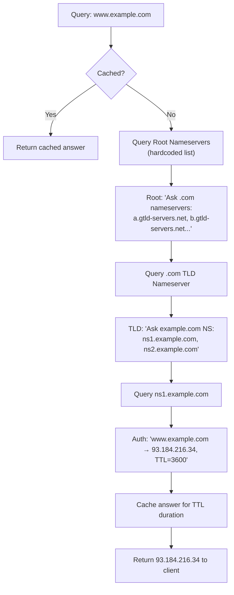
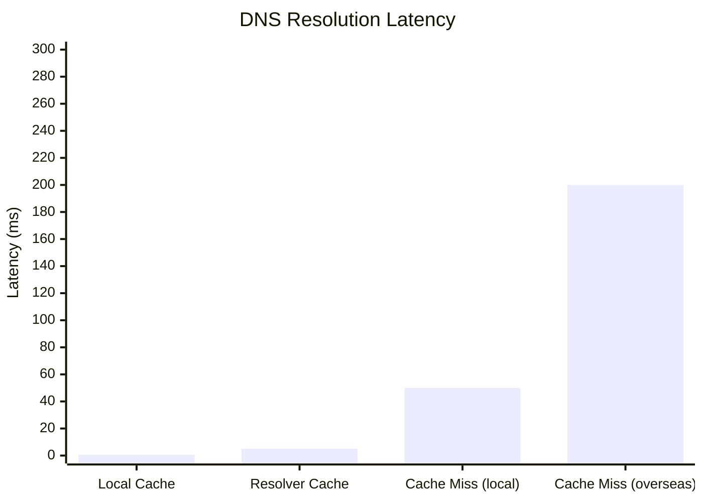
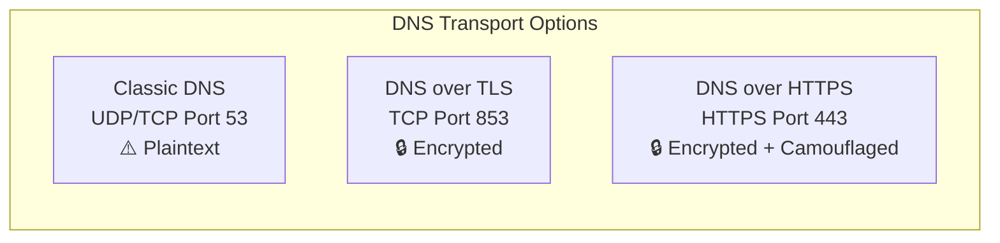
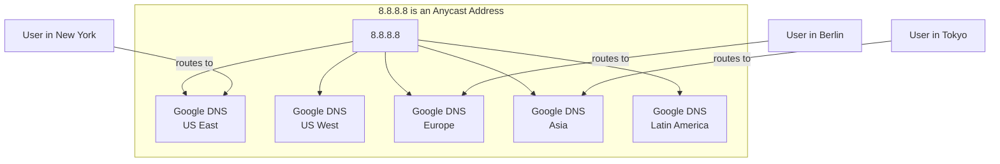

# Chapter 5: DNS Resolution — The World's Most Passive-Aggressive Phone Book

> *"Wow. It's not in the cache."*
> *"That's a big concern. That's a big concern."*
> — Every resolver, internally, every cache miss

---

## 5.1 The Resolution Process in Nauseating Detail

We covered the basics in Chapter 2. Now let's go deeper into how DNS resolution actually works, because understanding this is the key to understanding why things go wrong.

When your computer wants to resolve `www.example.com`, it goes through a specific process:

### Step 1: Check the Local Cache

Your operating system maintains a local DNS cache. If it has seen `www.example.com` recently (within the TTL), it returns the cached answer immediately. No network request needed. Fastest possible path.

```bash
# Check your local DNS cache on Linux
$ systemd-resolve --statistics

# Flush your DNS cache on Linux
$ sudo systemd-resolve --flush-caches

# On macOS
$ sudo dscacheutil -flushcache; sudo killall -HUP mDNSResponder

# On Windows
$ ipconfig /flushdns
```

### Step 2: Check the Hosts File

If the cache misses, the OS checks `/etc/hosts` (or the Windows equivalent). If there's an entry here, it uses that and stops. This overrides DNS entirely.

### Step 3: Ask the Configured Resolver

If neither of those have an answer, your OS sends a query to the DNS resolver(s) configured in your system. On Linux, these are listed in `/etc/resolv.conf`. On Windows, they're in network adapter settings.

```
# /etc/resolv.conf
nameserver 8.8.8.8    # Primary resolver
nameserver 8.8.4.4    # Secondary resolver (failover)
search example.com    # Default domain search suffix
```

The resolver receives your query for `www.example.com` and either:
- Returns it from its own cache (very common)
- Performs a **recursive resolution** to find the answer

### Step 4: Recursive Resolution

If the resolver doesn't have the answer cached, it performs recursive resolution:



---

## 5.2 The Search Domain — Where Confusion Hides

Your resolver configuration typically includes a **search domain** (or list of search domains). This is a list of domain suffixes that the resolver will try automatically if your query doesn't fully resolve.

```
# /etc/resolv.conf
search corp.example.com example.com
```

With this configuration, if you query for `api`, the resolver will try:
1. `api.corp.example.com`
2. `api.example.com`
3. `api.` (bare name, likely fails)

This is incredibly useful in internal networks — you can type `ssh webserver` instead of `ssh webserver.corp.example.com`. It is also a subtle security risk (SSRF, DNS rebinding) and a source of confusion when names resolve unexpectedly.

In Kubernetes, this becomes extremely relevant. More in Chapter 9.

---

## 5.3 The ndots Option — A Subtle Trap

In `/etc/resolv.conf`, there's an option called `ndots` that controls when the resolver considers a name "fully qualified" (and doesn't need to append search domains).

```
# /etc/resolv.conf
nameserver 10.96.0.10
search default.svc.cluster.local svc.cluster.local cluster.local
options ndots:5
```

The `ndots:5` setting means: "if the query has fewer than 5 dots, try the search domains first before treating it as a fully qualified name."

So if you query for `api.example.com` (2 dots), the resolver will:
1. Try `api.example.com.default.svc.cluster.local`
2. Try `api.example.com.svc.cluster.local`
3. Try `api.example.com.cluster.local`
4. Finally try `api.example.com.` (as intended)

This causes significant DNS query overhead in Kubernetes, which we'll cover in Chapter 10.

---

## 5.4 Round-Trip Time and DNS Performance

DNS queries are UDP by default (with TCP fallback for large responses or when explicitly needed for zone transfers). A typical DNS query over the public internet takes:

| Scenario | Typical RTT |
|----------|-------------|
| Cache hit (local) | < 1ms |
| Cache hit (resolver) | 1-10ms |
| Cache miss (same continent) | 20-100ms |
| Cache miss (overseas) | 100-300ms |
| Root nameserver query | 5-50ms (anycast) |

DNS is *fast* when it's cached. It's surprisingly slow when it's not — especially for applications that make many DNS lookups per request, or that don't cache DNS results themselves.



---

## 5.5 DNS and TCP vs UDP

DNS uses **UDP port 53** by default because UDP is connectionless and fast — perfect for small query/response pairs. If the response is too large for a single UDP packet (larger than 512 bytes originally, 4096 bytes with EDNS0), DNS falls back to **TCP port 53**.

DNSSEC (covered in Chapter 8) dramatically increases response sizes, making TCP fallback much more common in DNSSEC-enabled environments.

DNS over TLS (DoT) uses **TCP port 853** and wraps DNS in TLS encryption. DNS over HTTPS (DoH) uses **HTTPS port 443** and makes DNS look like regular web traffic. Both are increasingly common in privacy-focused configurations.



---

## 5.6 EDNS0 — Making DNS Less Terrible

**EDNS0** (Extension Mechanisms for DNS, version 0) is a backwards-compatible extension to DNS that adds:

- Larger UDP message sizes (up to 4096 bytes, vs the original 512)
- Additional fields for security extensions (DNSSEC)
- Better signaling for DNS capabilities

EDNS0 is supported by essentially all modern DNS infrastructure but occasionally causes issues with old firewalls that don't understand the extended format and drop packets. If you're seeing mysterious DNS failures, an overly aggressive firewall blocking EDNS0 packets is on the troubleshooting list.

---

## 5.7 DNS Query Types and the Mystery of QTYPE

When your resolver asks for a DNS record, it specifies what *type* of record it wants. The most common queries:

| QTYPE | Means | Example |
|-------|-------|---------|
| A | IPv4 address | "What's the IP for example.com?" |
| AAAA | IPv6 address | "What's the IPv6 for example.com?" |
| MX | Mail server | "Where does mail for example.com go?" |
| TXT | Text record | "What TXT records exist for example.com?" |
| CNAME | Canonical name | "Is example.com an alias?" |
| NS | Nameservers | "What nameservers serve example.com?" |
| SOA | Zone info | "Who's authoritative for example.com?" |
| ANY | Everything | "Give me everything you have for example.com" |

The `ANY` query type sounds great — one query, all the records! But in practice:
1. Most modern authoritative nameservers return a minimal response to `ANY` queries for security reasons (DNS amplification attacks)
2. It's deprecated by RFC 8482
3. `dig example.com ANY` will often return less than you expect

---

## 5.8 DNS Response Codes — The RCODE Rosetta Stone

DNS responses include a 4-bit response code (RCODE) that indicates the result. The most important ones:

| RCODE | Name | Meaning |
|-------|------|---------|
| 0 | NOERROR | Success! The query was answered. |
| 1 | FORMERR | Format error — the query was malformed |
| 2 | SERVFAIL | Server failure — the resolver couldn't complete the query |
| 3 | NXDOMAIN | Name doesn't exist — the domain is not found |
| 4 | NOTIMP | Not implemented — the query type isn't supported |
| 5 | REFUSED | The server refused to answer this query |

When debugging DNS, always check the RCODE. They're different problems with different solutions:

- **NXDOMAIN**: The name doesn't exist. Either you spelled it wrong, the record wasn't created, or it was deleted.
- **SERVFAIL**: Something went wrong in resolution. Could be a broken nameserver, DNSSEC failure, or network issue.
- **REFUSED**: The server knows but won't tell you. Usually a misconfigured access control list.

```bash
# Check RCODE with dig
$ dig www.nonexistent-domain-12345.com
# Look for: ;; ->>HEADER<<- opcode: QUERY, status: NXDOMAIN
```

---

## 5.9 Glue Records — Bootstrap Problem Solved

Here's a fun chicken-and-egg problem: the TLD nameserver tells you "to find example.com, ask ns1.example.com." But wait — how do you look up ns1.example.com if ns1.example.com is *under* example.com? That's circular!

The answer is **glue records**. When a domain's nameserver is within the same domain (an "in-zone" nameserver), the registrar also stores the IP address of that nameserver in the TLD zone. This gives the resolver enough information to contact the nameserver without needing to resolve it first.

```
# From the .com TLD zone (simplified):
example.com.        IN    NS    ns1.example.com.
example.com.        IN    NS    ns2.example.com.
ns1.example.com.    IN    A     203.0.113.1    # This is a glue record
ns2.example.com.    IN    A     203.0.113.2    # This is a glue record
```

If you ever change your nameserver IP addresses, you must update the glue records at your registrar **and** the NS records in your zone. Updating only one will cause intermittent resolution failures. This is a common mistake.

---

## 5.10 Anycast — Why Root Nameservers Don't Fall Over

Earlier, we mentioned that there are 13 root nameserver addresses but over 1,600 physical instances. How does this work?

**Anycast** is a network routing technique where multiple servers worldwide share the same IP address. When you send a packet to an anycast IP, the network routes it to the geographically (or topologically) nearest instance.



Anycast is why DNS queries to `8.8.8.8` respond in ~5ms no matter where in the world you are. The query just goes to your nearest Google DNS node. This is also why Cloudflare picked `1.1.1.1` as their DNS address — it's memorably simple, and they had the network reach to serve it from everywhere.

---

*Next: [Chapter 6 — DNS Propagation: Hurry Up and Wait](06-dns-propagation.md)*
