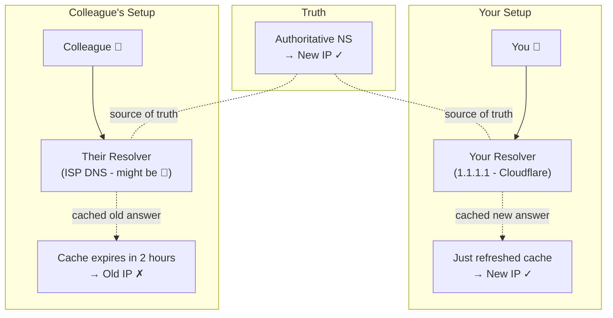
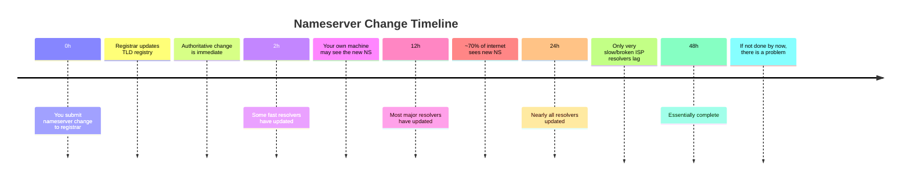

# Chapter 6: DNS Propagation — Hurry Up and Wait

> *"Is DNS propagated yet?"*
> *"No."*
> *"How about now?"*
> *"It's been 4 seconds."*
> *"How about now?"*
> — Every junior developer, on every DNS migration, everywhere

---

## 6.1 The Myth of "DNS Propagation"

Let's get something out of the way: "DNS propagation" is slightly misleading terminology.

DNS changes don't *propagate*. There's no central broadcast. No signal goes out from your DNS provider saying "HEY EVERYONE, EXAMPLE.COM CHANGED." What actually happens is that caches **expire** and resolvers **refresh**.

When you change a DNS record:
1. Your authoritative nameserver immediately serves the new answer
2. Every existing cache entry for that record continues serving the old answer until its TTL expires
3. As caches expire, resolvers ask your authoritative nameserver again and get the new answer
4. Gradually, across minutes to days, all the caches in the world update

"Propagation" suggests a push. The reality is a pull — caches pull the new data when their timers expire.

```mermaid
gantt
    title DNS "Propagation" is Really Cache Expiry
    dateFormat mm
    axisFormat %M min

    section Change Made at Time 0
    Authoritative NS serves new answer :done, 00, 120m

    section Resolver A (TTL=300, cached 2min ago)
    Serves old answer (298s left)      :crit, 00, 05m
    Serves new answer                  :active, 05, 115m

    section Resolver B (TTL=300, cached 1min ago)
    Serves old answer (240s left)      :crit, 00, 04m
    Serves new answer                  :active, 04, 116m

    section Resolver C (TTL=3600, cached 30min ago)
    Serves old answer (3300s = 55min)  :crit, 00, 55m
    Serves new answer                  :active, 55, 65m

    section Old ISP Resolver (TTL=86400, cached yesterday)
    Serves old answer for up to 24h    :crit, 00, 120m
```



---

## 6.2 Why "DNS Takes 24-48 Hours to Propagate"

You've heard this. Your hosting provider's support page says it. Your domain registrar warns you. "DNS changes take 24-48 hours to propagate."

Where does 24-48 hours come from?

The short answer: **it's the default TTL** from the old days. DNS used to default to TTLs of 86400 (24 hours) or 172800 (48 hours). In that era, if you made a DNS change, you genuinely might wait 48 hours for the world to see it.

The long answer: **it depends entirely on your TTL.**

If your TTL is 300 seconds (5 minutes), your DNS "propagates" in about 5-10 minutes. If your TTL is 86400 (24 hours), it takes up to 24 hours. The "24-48 hours" advice is a historical artifact from when 24-hour TTLs were standard.

Modern best practice: set TTL to 300-3600 seconds. You'll never wait 24 hours again.

> **The Support Ticket Meme:**
> Customer: "My DNS change isn't working after 30 minutes."
> Support: "DNS can take 24-48 hours to propagate."
> [48 hours later]
> Customer: "DNS still isn't working."
> Support: "Hmm, let me check... you have a typo in your DNS record."
>
> The 24-48 hours warning is so ingrained that it's used to deflect debugging. Don't accept it. If your TTL is 300 and you've waited 10 minutes, something else is wrong.

---

## 6.3 Tools to Check Propagation

Several tools let you check DNS records from multiple geographic locations simultaneously, so you can see which resolvers have the new records and which are still serving the old ones.

**Online Tools:**
- `dnschecker.org` — Shows A/AAAA/CNAME/MX/TXT from dozens of locations worldwide
- `mxtoolbox.com` — Great for MX and email-related DNS debugging
- `whatsmydns.net` — Similar to dnschecker, good geographic coverage
- `intodns.com` — Full DNS zone health check

**Command-Line Tools:**
```bash
# Query a specific nameserver to bypass your local cache
$ dig @8.8.8.8 www.example.com A       # Query Google DNS
$ dig @1.1.1.1 www.example.com A       # Query Cloudflare DNS
$ dig @ns1.example.com www.example.com A  # Query authoritative directly

# Check what TTL remains in a cache (this is time left, not original TTL)
$ dig @8.8.8.8 www.example.com A
# Look for the number in the ANSWER SECTION - if original TTL was 3600 and
# it shows 1823, the resolver cached it 1777 seconds ago

# Trace the full resolution path
$ dig +trace www.example.com A

# Short output format
$ dig +short www.example.com A
```

---

## 6.4 The dig Command — Your Best Friend

`dig` (Domain Information Groper) is the single most important DNS debugging tool. Learn it. Love it. Use it obsessively.

```bash
$ dig www.example.com

; <<>> DiG 9.16.1 <<>> www.example.com
;; global options: +cmd
;; Got answer:
;; ->>HEADER<<- opcode: QUERY, status: NOERROR, id: 12345
;; flags: qr rd ra; QUERY: 1, ANSWER: 1, AUTHORITY: 0, ADDITIONAL: 1

;; QUESTION SECTION:
;www.example.com.               IN      A

;; ANSWER SECTION:
www.example.com.        3600    IN      A       93.184.216.34
                        ^^^^
                        Current TTL remaining in cache (or original if just fetched)

;; Query time: 23 msec
;; SERVER: 8.8.8.8#53(8.8.8.8)
;; WHEN: Mon Mar 24 10:00:00 UTC 2024
;; MSG SIZE  rcvd: 56
```

Key parts to read:
- `status: NOERROR` — the query succeeded
- `ANSWER SECTION` — the actual DNS records
- TTL number — the remaining cache time (or original if freshly fetched)
- `SERVER: 8.8.8.8` — which resolver answered
- `Query time: 23 msec` — how long it took

```bash
# Useful dig flags
$ dig +trace example.com          # Trace full resolution from root
$ dig +short example.com          # Just the IP
$ dig example.com MX              # Query MX records
$ dig example.com TXT             # Query TXT records
$ dig example.com NS              # Query nameservers
$ dig @ns1.example.com example.com  # Ask specific nameserver
$ dig -x 93.184.216.34            # Reverse DNS lookup
$ dig +noall +answer example.com  # Only show answer section
```

---

## 6.5 Why You and Your Colleague See Different Things

The most common DNS confusion: you make a change, you see the new version, your colleague still sees the old version. How?



This isn't a bug. This isn't a failure. This is DNS working exactly as designed. Both of you are "right" from your resolver's perspective.

To verify which version *you* are seeing vs. which version *the authoritative server* says:

```bash
# What does the authoritative server say? (ground truth)
$ dig @ns1.example.com www.example.com

# What does your resolver say? (what you see)
$ dig www.example.com

# What does Google say? (different cache)
$ dig @8.8.8.8 www.example.com

# What does Cloudflare say? (different cache)
$ dig @1.1.1.1 www.example.com
```

---

## 6.6 Nameserver Change Propagation — The Slowest Thing in DNS

Changing your nameservers (pointing your domain to a new DNS provider) is the slowest DNS change you can make.

Here's why: NS records at the TLD level (e.g., in Verisign's `.com` zone) typically have very high TTLs — 48 hours (172800 seconds) is common. When you submit a nameserver change to your registrar, they update the TLD registry, but the old NS records can live in caches for up to 2 days.

Furthermore, many resolvers honor the TTL for NS records even more conservatively than for regular records. Some ISP resolvers are known to cache NS records for far longer than the TTL specifies.

Timeline for nameserver changes:



---

## 6.7 The Propagation Checker Trap

A note on propagation checker tools: they check from many locations, but they're only as good as the resolvers they use. Just because `dnschecker.org` shows "all green" doesn't mean 100% of your users see the new record.

In particular:
- Corporate networks with their own resolvers aren't checked
- Some ISPs have very slow caches
- Mobile carrier DNS resolvers can be surprising

A practical approach:

```bash
# Check from multiple public resolvers directly
for resolver in 8.8.8.8 1.1.1.1 9.9.9.9 208.67.222.222; do
    echo -n "Resolver $resolver: "
    dig @$resolver +short www.example.com A
done
```

If all public resolvers agree on the new IP, you're in good shape. If they disagree, propagation is still happening.

---

## 6.8 Propagation and Your Monitoring

One often-overlooked issue: your monitoring/alerting system also uses DNS, and it has its own cache. If you're doing a migration and your monitors check via DNS:

1. You switch DNS
2. Your monitor's resolver still has the old cached answer
3. Your monitor happily reports "everything is up" while users are hitting issues
4. OR your monitor's cache updates before users' caches and it reports errors that aren't user-visible yet

During migrations, supplement DNS-based monitoring with direct IP monitoring:

```bash
# Monitor new IP directly, bypassing DNS
curl --resolve www.example.com:443:NEW_IP https://www.example.com/health

# Or bypass DNS entirely with curl -H
curl -H "Host: www.example.com" https://NEW_IP/health
```

---

*Next: [Chapter 7 — Common DNS Mistakes and How to Make All of Them](07-common-mistakes.md)*
