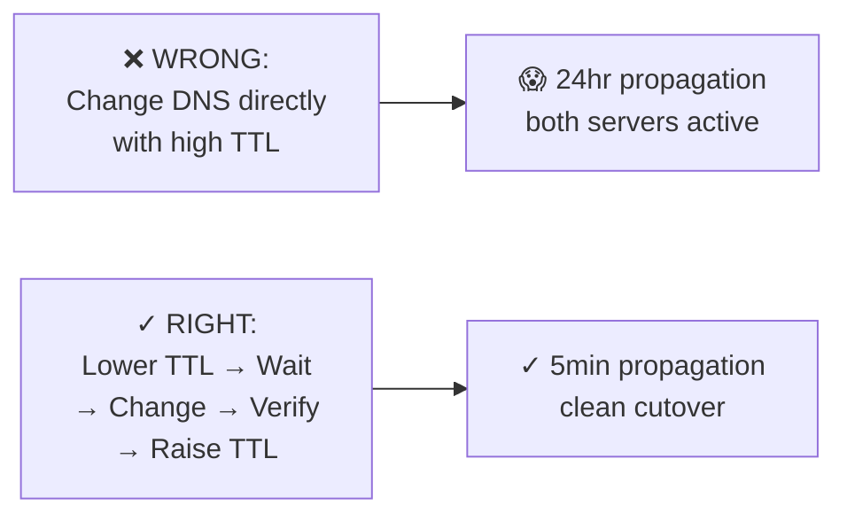
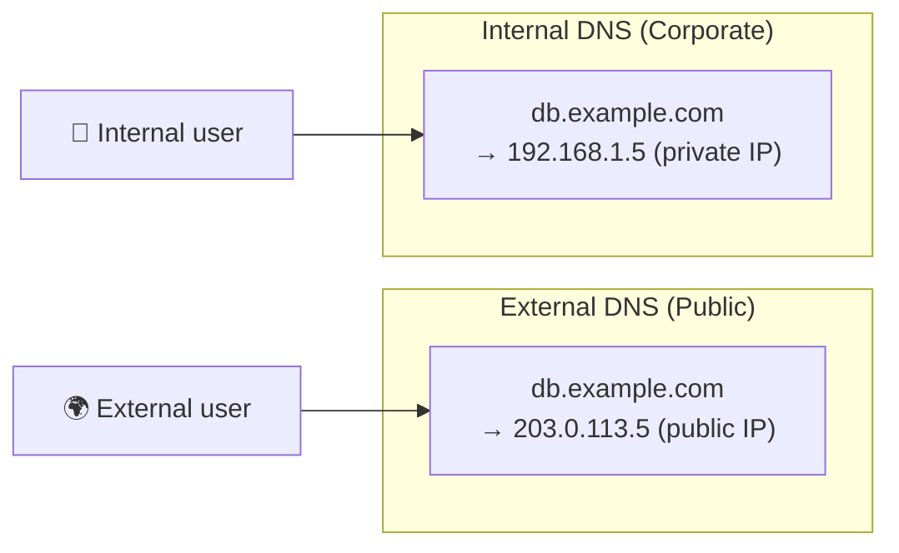

# Chapter 7: Common DNS Mistakes and How to Make All of Them

> *"The definition of insanity is doing the same DNS change without lowering your TTL first and expecting a different result."*
> — Albert Einstein (probably not, but he should have)

---

## 7.1 A Hall of Shame

DNS has been around since 1983. In those four decades, every possible mistake has been made, documented, and then made again by someone who didn't read the documentation. This chapter is a lovingly curated collection of the greatest hits.

Consider this chapter a field guide to DNS incidents. With any luck, you will recognize your own situation somewhere in here and fix it before it becomes a 3am page.

---

## 7.2 Mistake #1: Not Lowering TTL Before a Migration

We covered this in Chapter 4, but it bears repeating in the Hall of Shame because it is the most common DNS mistake, by a wide margin.

**What happens:**
1. You have `www.example.com` pointing to `1.2.3.4` with TTL=86400
2. You set up a new server at `5.6.7.8`
3. You change the DNS record to point to `5.6.7.8`
4. You announce the migration complete
5. Users from ISPs with long-cached DNS spend the next 24 hours hitting the old server
6. You spend the next 24 hours explaining DNS to your boss

**The fix:** Lower TTL to 300 at least [old TTL] duration before making the change. Then change. Then raise TTL.



---

## 7.3 Mistake #2: The Trailing Dot Trap

In DNS, a fully qualified domain name ends with a dot: `www.example.com.`

The trailing dot means "this is absolute, don't append search domains." Without it, some DNS tools and zone files will treat the name as relative and append the zone name.

**In zone files, this is catastrophic:**
```
; Zone file for example.com
; BAD - missing trailing dot:
www    IN    A    1.2.3.4    ; resolves to www.example.com ✓ (relative to zone)
mail   IN    MX   10  mailserver    ; mailserver becomes mailserver.example.com ✓

; Also in zone file, but REALLY BAD:
www    IN    CNAME  otherdomain.com  ; becomes otherdomain.com.example.com ✗!!!

; GOOD - with trailing dot:
www    IN    CNAME  otherdomain.com.  ; stays as otherdomain.com ✓
```

This mistake typically manifests as mysterious CNAME chains or records resolving to unexpected names. The error message (if you get one) will make no sense. You'll look at the record, it'll look correct, and you'll want to throw your laptop.

Always use a trailing dot when entering FQDNs in zone files and DNS management UIs that support zone file syntax.

---

## 7.4 Mistake #3: CNAME at the Apex (Root Domain)

You want `example.com` (not www) to resolve. You try to put a CNAME there pointing to your load balancer or CDN hostname. Your DNS provider either:
a) Refuses to save it
b) Lets you save it and it quietly breaks things
c) Pretends to accept it and silently ignores it

**Why it's wrong:** The root domain (`example.com`) must have SOA and NS records. RFC 1034 says you can't have a CNAME alongside other records. Root domains need SOA and NS records. Putting a CNAME there violates the RFC.

**Solutions:**
- Use a **redirect** from `example.com` to `www.example.com` at your web server
- Use provider-specific solutions: Cloudflare CNAME Flattening, AWS ALIAS record, Netlify's custom domains
- Switch to a DNS provider that supports ALIAS/ANAME records

---

## 7.5 Mistake #4: MX Record Pointing to CNAME

Your email is mysteriously broken. You check your MX record — it looks fine! But something is wrong.

```
; BAD:
example.com.    IN    MX    10    mail-alias.example.com.
mail-alias.example.com.  IN  CNAME  mail.provider.com.

; GOOD:
example.com.    IN    MX    10    mail.provider.com.
```

RFC 2181 explicitly prohibits MX (and NS) records from pointing to CNAMEs. Many mail servers check this and will refuse to deliver mail if they detect an MX → CNAME chain. Email delivery will "mostly work" with some mail servers and fail with others, creating an incredibly frustrating intermittent issue.

---

## 7.6 Mistake #5: Forgetting to Update Reverse DNS

You've set up a mail server. You have SPF, DKIM, and DMARC configured. Your emails are still going to spam. You've checked everything. It all looks right.

Did you set up your PTR record?

Mail servers check PTR records (reverse DNS) to verify that the sending server is legitimate. If your mail server sends from IP `5.6.7.8`, there should be a PTR record:

```
8.7.6.5.in-addr.arpa.    IN    PTR    mail.example.com.
```

PTR records are controlled by the IP address owner (your hosting provider), not by you via your domain's DNS. You need to go into your hosting provider's panel or contact them to set the PTR record. Many developers are unaware this step exists.

---

## 7.7 Mistake #6: The Wildcard DNS Trap

Wildcard DNS records (`*`) match any subdomain that doesn't have a more specific record:

```
*.example.com.    300    IN    A    1.2.3.4
```

This sounds great! Any subdomain automatically resolves! Until:
1. You create a new subdomain `api.example.com` pointing to a different server
2. You mistype it as `aip.example.com` in your config
3. `aip.example.com` still resolves (via the wildcard) and you never notice the typo
4. You add a new service at `payment.example.com` and forget to add a DNS record
5. Wildcard resolves it. Traffic goes to the wrong server. Things happen.

Wildcards are also a security concern — any attacker who can get a certificate for `whatever.example.com` (via DNS-01 ACME challenge) may be able to use the wildcard to redirect users.

Use wildcards deliberately and carefully.

---

## 7.8 Mistake #7: Split-Brain DNS Without Realizing It

**Split-brain DNS** (also called split-horizon DNS) is when you have different DNS answers for internal and external queries. Used intentionally, it's a powerful pattern. Encountered accidentally, it's a nightmare.



When split-brain DNS happens accidentally:
- You update the public DNS, but internal DNS is separate and still has the old record
- Internal users ("works for me!") and external users ("site is down!") see different things
- Nobody thinks to check the internal DNS server
- The incident goes on for hours

Signs of accidental split-brain DNS:
- "It works on my machine" (you're internal) but broken externally
- Inconsistent behavior between team members (some on VPN, some not)
- DNS lookups returning different results on the same machine when VPN is on vs off

---

## 7.9 Mistake #8: The Forgotten DNS Dependency

You're migrating your web application to a new infrastructure. You've updated every config file. You've tested everything. You do the cutover. Things break in mysterious ways.

Did you check every service that makes DNS-based connections?

Common forgotten DNS dependencies:
- **Email delivery**: SMTP servers looking up your MX records
- **Certificate renewal**: ACME clients doing DNS-01 challenges
- **Service discovery**: Internal services connecting to each other by hostname
- **Third-party integrations**: Webhooks, OAuth callbacks, CDN origins
- **Monitoring systems**: Health checks using DNS to reach your services
- **Database connections**: Database drivers that resolve hostnames at connection time

```bash
# Find DNS dependencies in your code
grep -rE "(dns|hostname|host|endpoint|url)" ./config/ | grep -v ".git"

# Find hardcoded IPs (which bypass DNS but are also a problem)
grep -rE "\b([0-9]{1,3}\.){3}[0-9]{1,3}\b" ./config/
```

---

## 7.10 Mistake #9: TTL Set to 0

TTL=0 means "do not cache this record." Every query goes directly to the authoritative nameserver. This is occasionally useful for testing, but catastrophic in production.

A popular website with TTL=0:
- Generates millions of queries per second to the authoritative nameserver
- Massively increases latency for all users (no cache = always full resolution)
- Creates a massive bill from your DNS provider if they charge per query
- Is one DDoS away from total failure

There's also a subtlety: some resolvers don't honor TTL=0 and will cache for a short time anyway (usually 5-30 seconds). So even TTL=0 doesn't guarantee instant propagation.

When is TTL=0 appropriate?
- Never in production
- Testing record changes in development
- Rate-limited debugging (very temporarily)

---

## 7.11 Mistake #10: Deleting a DNS Record While Traffic Still Goes There

"The old service is decommissioned. Let's clean up and delete the DNS record."

**Wait.** Check the TTL. If the TTL is 3600, cached answers will continue to direct traffic to that service for up to an hour after you delete the record. If you've already decommissioned the servers, that traffic will get connection refused errors.

The correct order:
1. First: Remove traffic from the endpoint (rate limit, redirect, etc.)
2. Wait: Until you're confident no legitimate traffic remains
3. Delete: The DNS record
4. Wait: At least TTL duration (for caches to expire)
5. Decommission: The servers

Nobody does this. Servers get deleted and then DNS entries get cleaned up later. Sometimes there's a brief period of errors. Sometimes it causes a significant outage if traffic was still flowing. Plan ahead.

---

## 7.12 Mistake #11: Trusting "It Works In Staging"

Your staging environment has its own DNS configuration. It may not have the same TTL values, the same record structure, or the same resolvers as production. Testing DNS changes in staging doesn't validate your production DNS behavior.

Always test DNS in a production-like environment. If you can't do that, at least:
1. Manually verify TTL values in production before any migration
2. Test with `dig` against your production authoritative nameserver
3. Factor in the production TTL for your migration timeline, not the staging TTL

---

## 7.13 The DNS Incident Bingo Card

How many of these have you experienced?

| | | |
|--|--|--|
| "It works for me" (split-brain) | Forgot to lower TTL | MX points to CNAME |
| Trailing dot missing in zone file | TTL set to 86400 for years | PTR record never configured |
| **FREE: It Was DNS** | Wildcard mask hiding a typo | Deleted record before decommission |
| SOA serial not incremented | CNAME at root domain | Forgot internal DNS server |
| Glue record not updated | Cached NXDOMAIN causing phantom failures | Java app cached DNS forever |

---

*Next: [Chapter 8 — DNS Security: Because the Internet Is a Scary Place](08-dns-security.md)*
