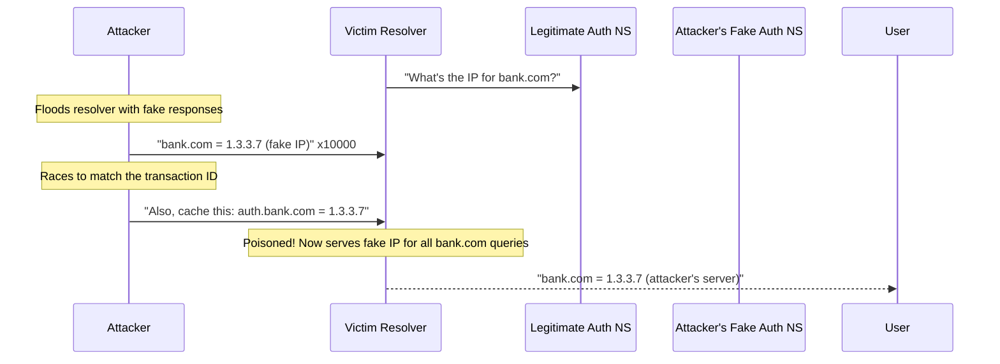
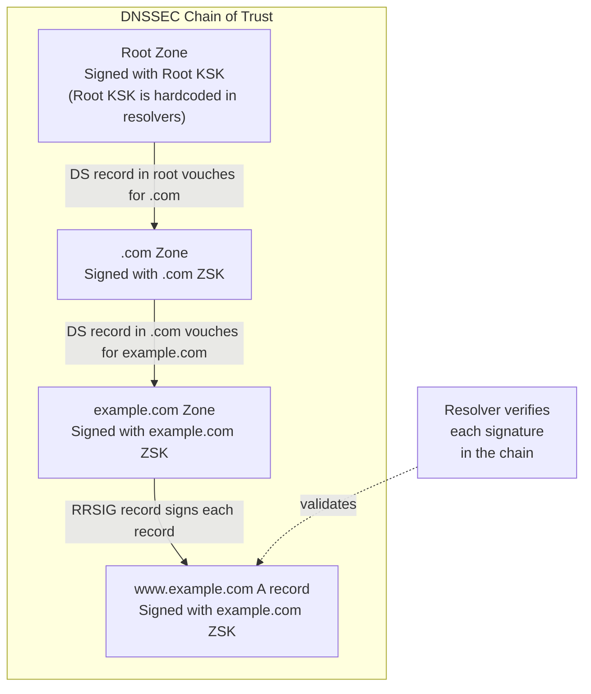
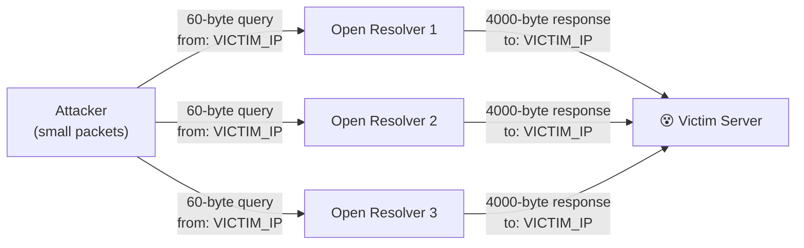
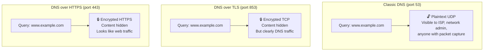
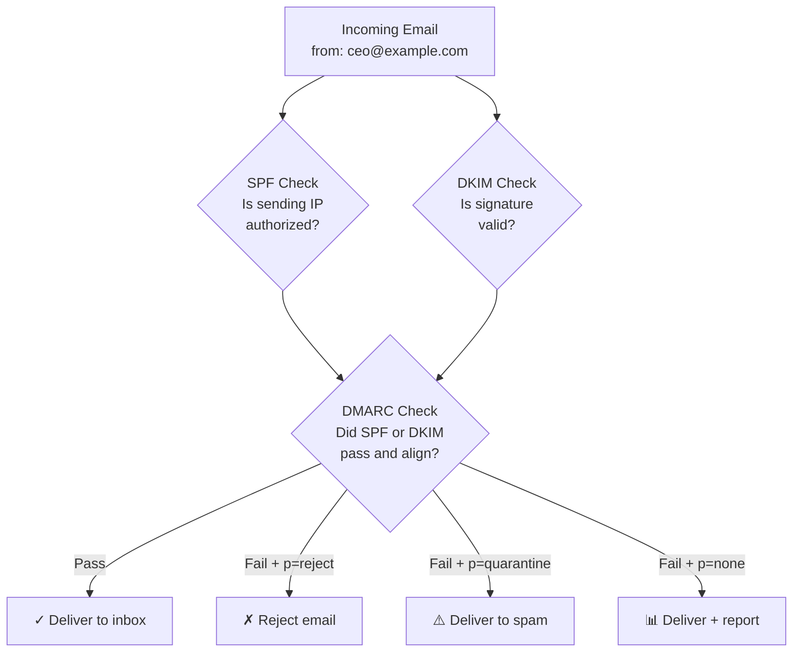

# Chapter 8: DNS Security — Because the Internet Is a Scary Place

> *"There are 10 types of people in the world: those who understand DNS security, those who don't, and those who have been attacked because they don't."*
> — Number 2 doesn't know about Number 3 yet

---

## 8.1 DNS Was Not Designed for a Hostile World

DNS was designed in 1983, when the internet was a friendly academic network where everyone knew each other and nobody was trying to steal your credentials. Security was an afterthought — or rather, not a thought at all.

The original DNS protocol:
- Sends queries in plaintext (UDP)
- Has no authentication of responses
- Has no verification that answers come from legitimate servers
- Has no encryption of any kind
- Uses predictable transaction IDs

This is roughly equivalent to designing a lock system where the key is your name written on a piece of paper, handed to a stranger, who reads it aloud in a crowded room, and then your door just opens.

Over the decades, various people have noticed these problems and invented patches, workarounds, extensions, and entirely new protocols to address them. This chapter covers the threats and the defenses.

---

## 8.2 DNS Cache Poisoning — Putting Lies in the Cache

**Cache poisoning** (or **DNS spoofing**) is an attack where a malicious actor injects false DNS records into a resolver's cache. Anyone who uses that resolver subsequently gets directed to the attacker's IP instead of the legitimate one.

The classic attack (Kaminsky Attack, 2008):



Dan Kaminsky discovered a fundamental flaw that allowed this attack to work much more efficiently than previously thought. He worked with DNS vendors and operators to deploy a fix (source port randomization + transaction ID randomization) before disclosing it. This was one of the largest coordinated security disclosures in internet history.

The fix increased the search space an attacker must brute-force from ~65,536 (just the transaction ID) to ~2.7 billion (transaction ID + source port). Better, but not perfect.

The real fix is DNSSEC.

---

## 8.3 DNSSEC — Cryptographic Signatures for DNS

**DNSSEC** (DNS Security Extensions) adds cryptographic signing to DNS records. Instead of trusting that a DNS response is legitimate, you can *verify* it using public key cryptography.

How it works:



With DNSSEC:
- Every DNS record is signed with a private key
- The corresponding public key is published in the zone
- Each parent zone contains a DS (Delegation Signer) record vouching for the child
- Resolvers with DNSSEC validation can verify the entire chain from root to the record
- Any tampering with a record invalidates the signature → SERVFAIL instead of poisoned answer

**DNSSEC isn't encryption** — DNS records are still transmitted in plaintext. DNSSEC only provides *authentication* (the answer came from the legitimate zone) and *integrity* (the answer wasn't modified in transit).

---

## 8.4 DNSSEC in Practice — The Good, the Bad, and the SERVFAIL

DNSSEC is technically sound but operationally complex. It has seen slow adoption partly because:

1. **Key management is hard**: You have two key types (ZSK and KSK), they need rotation, and if you mess it up, your entire domain becomes unresolvable.

2. **DNSSEC failures are catastrophic**: A regular DNS failure is an NXDOMAIN (domain not found). A DNSSEC validation failure is a SERVFAIL (generic error) — indistinguishable from "server is broken." Users just see "site not loading."

3. **Key signing key rollover is terrifying**: The Root Zone performed its first KSK rollover in 2018. It was a global event. Some poorly-configured resolvers temporarily couldn't resolve anything.

4. **Amplification attacks**: DNSSEC responses are much larger than regular DNS responses, making DNS servers more effective for DDoS amplification attacks (more on this shortly).

Despite the complexity, DNSSEC should be enabled for your domains. Most modern DNS providers handle the operational complexity for you.

```bash
# Check if a domain has DNSSEC enabled
$ dig example.com DNSKEY +short
# If this returns results, DNSSEC is configured

# Validate DNSSEC for a domain
$ dig example.com A +dnssec
# Look for "ad" (authenticated data) flag in the response header
```

---

## 8.5 DNS Hijacking — When Your DNS Provider Is Compromised

**DNS hijacking** occurs when an attacker gains control of a domain's DNS records — either by compromising the DNS provider, stealing the registrar account credentials, or attacking the registrar itself.

Notable incidents:
- **2019 Sea Turtle Campaign**: Nation-state actors hijacked DNS for government and military domains by compromising registrars and DNS providers
- **2013 NY Times DNS hijack**: Syrian Electronic Army changed NY Times' DNS to redirect visitors
- **2020 Cloudflare Registrar attack**: Voicemail social engineering was used to steal domains

Defenses:
1. **Enable 2FA on your DNS provider and registrar** — this is non-negotiable
2. **Registry Lock**: Many TLDs offer registry locks that require out-of-band verification for NS changes
3. **DNSSEC**: Cryptographic verification means hijacked DNS (with invalid signatures) will fail validation
4. **CAA records**: Prevent unauthorized SSL certificate issuance
5. **Monitor your DNS records**: Use DNS monitoring services to alert on unexpected changes

```bash
# Monitor your DNS records with a simple script
EXPECTED="93.184.216.34"
ACTUAL=$(dig +short www.example.com A)
if [ "$ACTUAL" != "$EXPECTED" ]; then
    echo "ALERT: DNS has changed! Expected $EXPECTED, got $ACTUAL"
    # Send alert, page on-call, etc.
fi
```

---

## 8.6 DNS Amplification Attacks — Your DNS Server as a Weapon

DNS amplification is a DDoS attack technique that exploits DNS's response-to-query size ratio.

A DNS query might be 60 bytes. The response to a DNS ANY or DNSKEY query might be 4,000 bytes. That's a **67x amplification factor**.

The attack:
1. Attacker sends small DNS queries to many open resolvers
2. They spoof the source IP as the victim's IP
3. The resolvers send large responses to the victim
4. The victim is flooded with traffic they didn't ask for



**How to not be part of the problem:**
- Run a **closed resolver** — only answer queries from your own network, not the entire internet
- Enable **Response Rate Limiting (RRL)** on your authoritative nameservers
- Support and implement **BCP38** (prevent IP spoofing at the network level)

---

## 8.7 DNS over TLS and DNS over HTTPS — Privacy in the Modern Era

Classic DNS is completely plaintext. Your ISP can see every domain you resolve. Anyone on your local network can too. This is a significant privacy concern.

**DNS over TLS (DoT)** wraps DNS queries in TLS encryption, sending them over TCP port 853. It's encrypted but distinguishable from regular traffic (it uses a non-standard port).

**DNS over HTTPS (DoH)** sends DNS queries as HTTPS requests over port 443. It looks identical to regular web traffic, making it impossible for network intermediaries to distinguish DNS queries from HTTPS connections.



**The DoH controversy:** Because DoH uses HTTPS port 443, it bypasses network-level DNS filtering. This is great for privacy. It's also a headache for corporate IT teams that use DNS filtering for security and content control.

When Firefox enabled DoH by default in 2019, corporate IT teams had... opinions.

```bash
# Test DoH manually with curl
curl -s -H 'accept: application/dns-json' \
  'https://cloudflare-dns.com/dns-query?name=example.com&type=A'

# Or with the wire format
curl -s "https://1.1.1.1/dns-query" \
  -H 'Content-Type: application/dns-message' \
  --data-binary @- <<< $'\x00\x01\x01\x00\x00\x01...'
```

---

## 8.8 The Email Security Trinity: SPF, DKIM, and DMARC

Three DNS-based email security mechanisms work together to prevent email spoofing and phishing. They all live in TXT records.

### SPF (Sender Policy Framework)
Specifies which mail servers are authorized to send email for your domain.

```
example.com.    IN    TXT    "v=spf1 include:_spf.google.com include:mailchimp.com ~all"
```

- `include:_spf.google.com` — Google Workspace is authorized to send
- `include:mailchimp.com` — Mailchimp is authorized to send
- `~all` — Soft fail for anything else (mark as suspect, don't reject)
- `-all` — Hard fail for anything else (reject)

### DKIM (DomainKeys Identified Mail)
Cryptographically signs outgoing email. The signature can be verified against the public key in DNS.

```
selector._domainkey.example.com.    IN    TXT    "v=DKIM1; k=rsa; p=MIGfMA0GCSqGSIb3DQEBAQUAA..."
```

### DMARC (Domain-based Message Authentication, Reporting and Conformance)
Tells receivers what to do when SPF and/or DKIM fail, and requests reports.

```
_dmarc.example.com.    IN    TXT    "v=DMARC1; p=reject; rua=mailto:dmarc@example.com; pct=100"
```

- `p=reject` — Reject email that fails SPF and DKIM
- `p=quarantine` — Send suspicious email to spam
- `p=none` — Do nothing, just report (monitoring mode)
- `rua=mailto:...` — Send aggregate reports here
- `pct=100` — Apply policy to 100% of messages



**The email security mistake:** Configuring SPF and/or DKIM but not DMARC, or configuring DMARC with `p=none` and forgetting to ever graduate to `p=reject`. Many organizations stay in "monitoring mode" forever and wonder why their domain is being spoofed in phishing attacks.

---

## 8.9 DNS as a Security Perimeter

Beyond protecting DNS itself, many organizations use DNS as a security control:

- **DNS filtering**: Block DNS queries to known malicious domains
- **DNS sinkholes**: Return a safe IP for malicious domains, letting you see who in your network is trying to reach them
- **DNS RPZ (Response Policy Zones)**: Allows resolvers to override responses for specific domains
- **Pi-hole / AdGuard Home**: Home/office DNS filtering for ad blocking and security

This is one reason why corporate IT is unhappy about DoH — it can bypass their DNS-based security controls by using a cloud resolver that isn't subject to their RPZ policies.

---

*Next: [Chapter 9 — DNS in Kubernetes: Here There Be Dragons](09-dns-in-kubernetes.md)*
