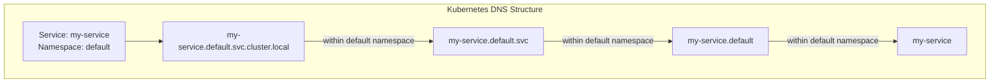
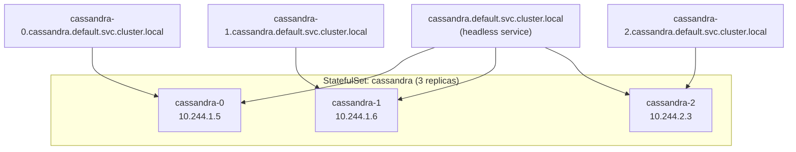
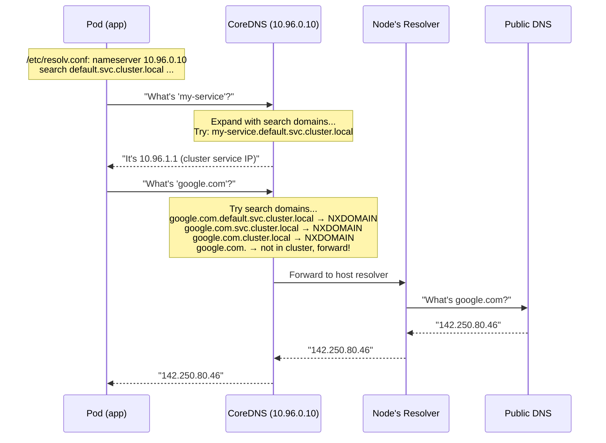
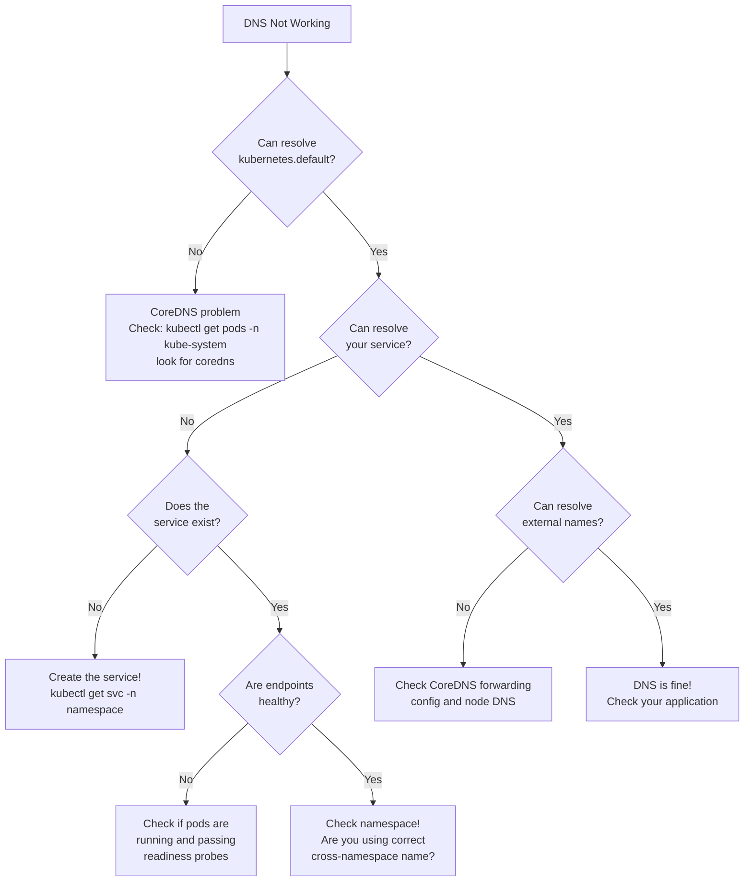
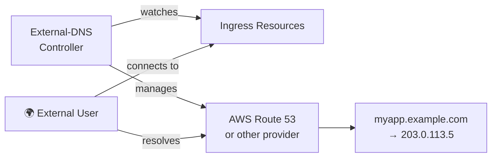

# Chapter 9: DNS in Kubernetes — Here There Be Dragons

> *"In Kubernetes, DNS is not just a service. It is the nervous system of the entire cluster. And sometimes it has a panic attack."*
> — Someone who has been paged at 3am about CoreDNS

---

## 9.1 Why Kubernetes DNS Is Different

In traditional infrastructure, DNS is something you configure once, mostly forget about, and occasionally debug. In Kubernetes, DNS is a **dynamic, continuously updated** system that is automatically maintained by the cluster itself.

Every time you create a Service, Kubernetes automatically creates DNS records for it. Every time you create a Pod, DNS entries may be created. When Services are deleted, DNS is cleaned up. This happens thousands of times per day in a busy cluster without any human intervention.

This is powerful. It's also a completely new set of things that can go wrong.

---

## 9.2 CoreDNS — The Heart of Kubernetes DNS

Modern Kubernetes clusters (since 1.13) use **CoreDNS** as the cluster DNS server. CoreDNS is a flexible, plugin-based DNS server written in Go. It replaced `kube-dns` (which was based on dnsmasq + a custom Go service + a sidecar) because kube-dns was... complicated.

CoreDNS runs as a Deployment in the `kube-system` namespace:

```bash
$ kubectl get pods -n kube-system -l k8s-app=kube-dns
NAME                      READY   STATUS    RESTARTS   AGE
coredns-5d78c9869d-r8jbx  1/1     Running   0          30d
coredns-5d78c9869d-xn9df  1/1     Running   0          30d
```

And it's exposed as a Service:

```bash
$ kubectl get svc -n kube-system kube-dns
NAME       TYPE        CLUSTER-IP   EXTERNAL-IP   PORT(S)         AGE
kube-dns   ClusterIP   10.96.0.10   <none>        53/UDP,53/TCP   30d
```

Every Pod in the cluster is configured to use `10.96.0.10` (or whatever your cluster's DNS service IP is) as its DNS resolver. This is set in each Pod's `/etc/resolv.conf`:

```
nameserver 10.96.0.10
search default.svc.cluster.local svc.cluster.local cluster.local
options ndots:5
```

---

## 9.3 The Kubernetes DNS Naming Convention

Kubernetes creates DNS records following a predictable convention:



The full hostname format for a Kubernetes Service is:

```
<service-name>.<namespace>.svc.<cluster-domain>
```

Where `cluster-domain` defaults to `cluster.local`.

| Query Format | Works From | Example |
|---|---|---|
| `my-service` | Same namespace | `my-service` → `10.96.1.1` |
| `my-service.default` | Any namespace | `my-service.default` → `10.96.1.1` |
| `my-service.default.svc` | Any namespace | `my-service.default.svc` → `10.96.1.1` |
| `my-service.default.svc.cluster.local` | Any namespace | Fully qualified |

The short form works because of the `search` domain list in `/etc/resolv.conf` — when you query `my-service`, the resolver tries `my-service.default.svc.cluster.local` (appending search domains).

---

## 9.4 Service DNS Records in Detail

Kubernetes creates different DNS records for different types of Services.

### ClusterIP Services
A ClusterIP Service gets an A record (or AAAA for IPv6) pointing to the cluster's virtual IP:

```
my-service.default.svc.cluster.local.    5    IN    A    10.96.1.1
```

It also gets an SRV record for each named port:

```
_http._tcp.my-service.default.svc.cluster.local.    5    IN    SRV    0 100 8080 my-service.default.svc.cluster.local.
```

### Headless Services
A headless Service (`clusterIP: None`) is special — instead of a single virtual IP, DNS returns the IP addresses of all individual pods backing the service:

```yaml
apiVersion: v1
kind: Service
metadata:
  name: my-headless-service
spec:
  clusterIP: None   # This makes it headless
  selector:
    app: my-app
  ports:
    - port: 8080
```

```
# Headless service returns multiple A records (one per pod)
my-headless-service.default.svc.cluster.local.    5    IN    A    10.244.1.5
my-headless-service.default.svc.cluster.local.    5    IN    A    10.244.1.6
my-headless-service.default.svc.cluster.local.    5    IN    A    10.244.2.3
```

This is critical for stateful applications (databases, caches) where you need to address individual pods directly.

### ExternalName Services
An ExternalName Service maps a cluster-internal DNS name to an external hostname:

```yaml
apiVersion: v1
kind: Service
metadata:
  name: external-db
spec:
  type: ExternalName
  externalName: my-database.us-east-1.rds.amazonaws.com
```

```
# ExternalName creates a CNAME record
external-db.default.svc.cluster.local.    5    IN    CNAME    my-database.us-east-1.rds.amazonaws.com.
```

This lets you refer to external services by internal names — great for portability between environments.

---

## 9.5 Pod DNS Records

Individual Pods can also get DNS records, though this is less common.

For Pods in a Deployment/ReplicaSet (without a subdomain), DNS records aren't automatically created. You get the Service record.

For Pods in a **StatefulSet**, each pod gets a predictable DNS name:

```
<pod-name>.<service-name>.<namespace>.svc.<cluster-domain>
```

For example:
```
# StatefulSet named "cassandra" with 3 replicas, Service named "cassandra"
cassandra-0.cassandra.default.svc.cluster.local    5    IN    A    10.244.1.5
cassandra-1.cassandra.default.svc.cluster.local    5    IN    A    10.244.1.6
cassandra-2.cassandra.default.svc.cluster.local    5    IN    A    10.244.2.3
```

This is **essential** for stateful applications — you can refer to specific replicas by name, which enables things like Cassandra seed node configuration and Kafka broker IDs.



---

## 9.6 CoreDNS Configuration — The Corefile

CoreDNS is configured with a file called the **Corefile**, stored in a ConfigMap:

```bash
$ kubectl get configmap -n kube-system coredns -o yaml
```

A typical Corefile:

```
.:53 {
    errors                   # Log errors
    health {                 # Health endpoint at /health
       lameduck 5s
    }
    ready                    # Ready endpoint at /ready
    kubernetes cluster.local in-addr.arpa ip6.arpa {  # Handle cluster DNS
       pods insecure          # Create pod DNS records
       fallthrough in-addr.arpa ip6.arpa
       ttl 30                 # TTL for cluster DNS records
    }
    prometheus :9153          # Metrics endpoint
    forward . /etc/resolv.conf {  # Forward non-cluster queries to host resolver
       max_concurrent 1000
    }
    cache 30                  # Cache responses for 30 seconds
    loop                      # Detect and break forwarding loops
    reload                    # Auto-reload config
    loadbalance               # Round-robin load balance responses
}
```

This is the critical piece: the `forward . /etc/resolv.conf` directive means that for any DNS query that *isn't* for a cluster-internal name, CoreDNS forwards it to the host node's DNS resolver, which then uses whatever DNS is configured at the infrastructure level.

---

## 9.7 The DNS Resolution Flow in Kubernetes

Let's trace a complete DNS resolution in a Kubernetes cluster:



Notice all the NXDOMAIN queries before the external lookup. This is the `ndots:5` problem — we'll quantify it in Chapter 10.

---

## 9.8 Cross-Namespace Service Discovery

When a Pod in namespace `frontend` wants to talk to a Service named `api` in namespace `backend`, it cannot use just `api` — the search domains only include the current namespace. It must use the full cross-namespace form:

```bash
# From a pod in "frontend" namespace:

# This works (same namespace):
curl http://frontend-service/path

# This FAILS (wrong namespace):
curl http://api/path          # Looks for api in "frontend" namespace

# This WORKS (fully qualified):
curl http://api.backend/path
curl http://api.backend.svc/path
curl http://api.backend.svc.cluster.local/path
```

This is a very common source of confusion for teams that are moving from a single-namespace to multi-namespace setup.

---

## 9.9 Configuring Pod DNS Settings

Kubernetes allows you to customize DNS settings per Pod or Deployment:

```yaml
apiVersion: v1
kind: Pod
metadata:
  name: custom-dns-pod
spec:
  dnsConfig:
    nameservers:
      - 8.8.8.8          # Additional DNS server
    searches:
      - ns1.svc.cluster.local
      - my-company.com   # Add custom search domain
    options:
      - name: ndots
        value: "2"       # Override ndots (reduces unnecessary lookups)
  dnsPolicy: ClusterFirst  # Default: use cluster DNS first, then node DNS
  containers:
    - name: app
      image: my-app:latest
```

**DNS Policy options:**

| Policy | Behavior |
|--------|----------|
| `ClusterFirst` | Default. Cluster DNS first, then node DNS for non-cluster names |
| `ClusterFirstWithHostNet` | Same as ClusterFirst, but when Pod uses hostNetwork |
| `Default` | Use the node's DNS settings (not the cluster DNS!) |
| `None` | Completely custom DNS config via `dnsConfig` |

> **Common Trap:** The `Default` policy does NOT use cluster DNS. It uses the node's `/etc/resolv.conf`. This means Pods with `dnsPolicy: Default` **cannot** resolve other Kubernetes services by name. Despite being named "Default," it is not the default.

---

## 9.10 Debugging DNS in Kubernetes

DNS problems in Kubernetes manifest as application errors, timeouts, or "connection refused" messages that look like network issues. The first step is always to verify DNS is working.

```bash
# Deploy a debug pod
kubectl run dns-debug --image=busybox --rm -it -- sh

# Inside the debug pod:
nslookup kubernetes.default.svc.cluster.local
nslookup my-service.my-namespace.svc.cluster.local
nslookup google.com

# Check the pod's resolv.conf
cat /etc/resolv.conf

# More detailed debugging with dnsutils
kubectl run dns-debug --image=infoblox/dnstools --rm -it -- sh

# Inside:
dig my-service.my-namespace.svc.cluster.local
dig @10.96.0.10 my-service.my-namespace.svc.cluster.local
```

Common Kubernetes DNS issues and their fixes:



---

## 9.11 CoreDNS Metrics and Monitoring

CoreDNS exposes Prometheus metrics at `:9153/metrics`. The most important metrics:

| Metric | What It Tells You |
|--------|-------------------|
| `coredns_dns_requests_total` | Total queries by type, response code |
| `coredns_dns_responses_total` | Response codes (SERVFAIL rate!) |
| `coredns_forward_requests_total` | How often queries are forwarded externally |
| `coredns_cache_hits_total` | Cache hit rate |
| `coredns_cache_misses_total` | Cache miss rate |
| `coredns_dns_request_duration_seconds` | Query latency histogram |

High SERVFAIL rates or high latency are the key signals that something is wrong with your cluster DNS.

---

## 9.12 DNS for Ingress — External Names for Internal Services

When you create an Ingress resource, Kubernetes doesn't automatically create external DNS records. You need something external to do this.

**External-DNS** is a popular Kubernetes controller that watches Services and Ingresses and automatically creates/updates DNS records in your external DNS provider (Route 53, Cloudflare, Google Cloud DNS, etc.):

```yaml
# Annotation to tell External-DNS to create a record
apiVersion: networking.k8s.io/v1
kind: Ingress
metadata:
  name: my-ingress
  annotations:
    external-dns.alpha.kubernetes.io/hostname: "myapp.example.com"
spec:
  rules:
    - host: myapp.example.com
      http:
        paths:
          - path: /
            pathType: Prefix
            backend:
              service:
                name: my-service
                port:
                  number: 80
```

External-DNS sees this annotation and creates `myapp.example.com → <ingress LB IP>` in your DNS provider.



---

*Next: [Chapter 10 — TTL in Kubernetes: A Special Kind of Pain](10-ttl-in-kubernetes.md)*
