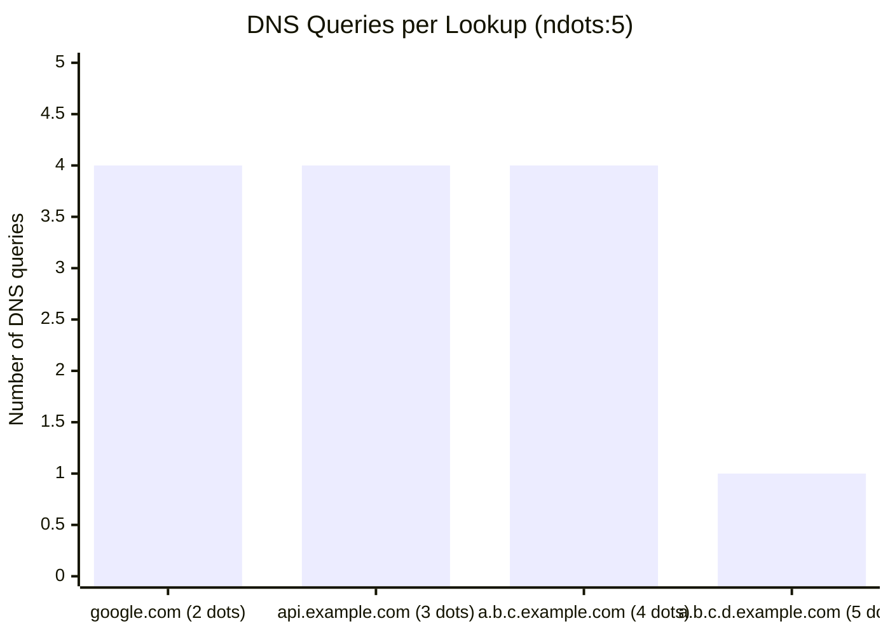
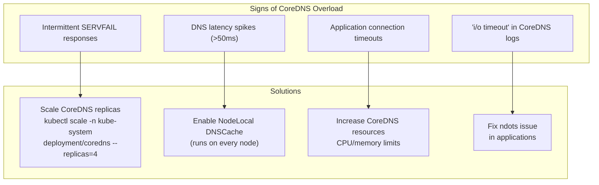
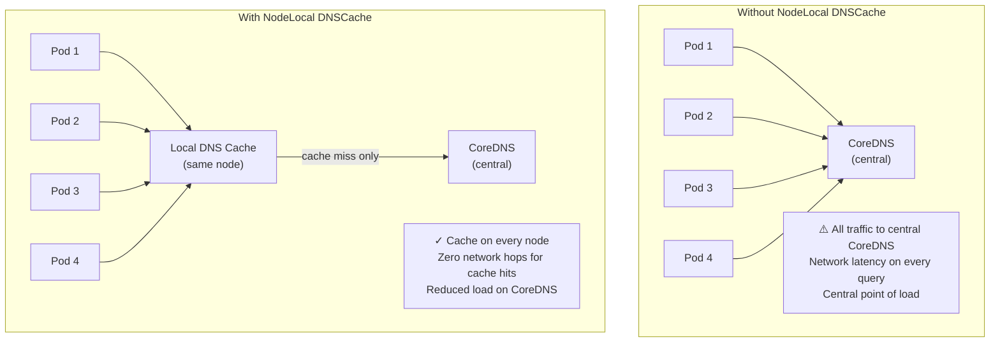
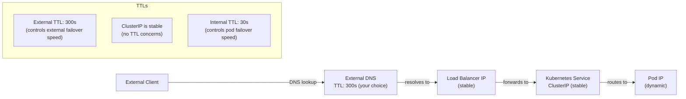
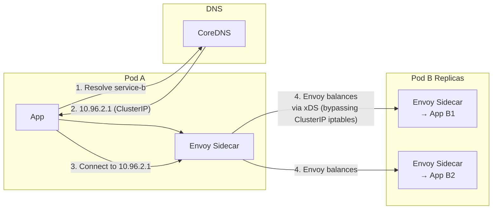
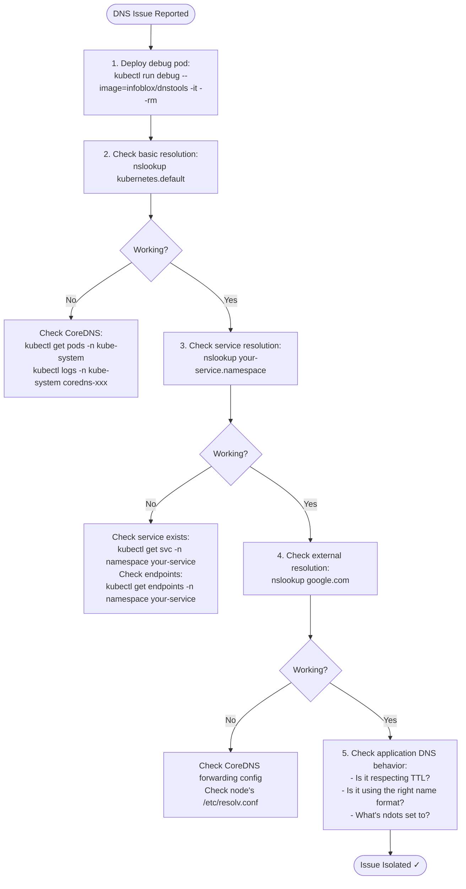

# Chapter 10: TTL in Kubernetes — A Special Kind of Pain

> *"DNS TTL in Kubernetes is like a game of Jenga, except all the blocks are labeled 'ndots' and one of them will eventually fall over at 2am on a Friday."*
> — Anonymous SRE, Kubernetes Slack, 2022

---

## 10.1 Kubernetes DNS TTL Is Different

In the previous chapter, we established how Kubernetes DNS works. In this chapter, we're going to talk about what happens when things move around — because in Kubernetes, things move around *constantly*.

Traditional DNS TTL is about one thing: how long to cache an answer before fetching a fresh one. In Kubernetes, TTL has additional dimensions:
1. The TTL of cluster-internal DNS records (usually very low — 5-30 seconds)
2. The TTL of external DNS records pointing to your cluster
3. How applications inside the cluster handle DNS caching
4. The infamous **ndots problem** that multiplies your DNS query volume

---

## 10.2 Kubernetes Internal DNS TTL

CoreDNS's default TTL for cluster-internal records is **30 seconds** (configurable via the `ttl` directive in the Corefile):

```
kubernetes cluster.local in-addr.arpa ip6.arpa {
   pods insecure
   fallthrough in-addr.arpa ip6.arpa
   ttl 30          ← This is the internal TTL
}
```

Why 30 seconds? Because Kubernetes Pods come and go. When a Pod crashes and is replaced, the new Pod gets a new IP address. If CoreDNS served that old IP for 5 minutes, applications would continue trying to connect to a dead Pod for 5 minutes before realizing it's gone.

30 seconds is a compromise between:
- Responsiveness to pod churn (lower = better)
- DNS query volume (lower = more queries)
- Stability during deployments (lower = more consistency)

For most services using ClusterIP (the virtual service IP), TTL is less critical — the virtual IP stays stable. For headless services (individual pod IPs), low TTL is essential.

---

## 10.3 The ndots Problem — Multiplying DNS Queries

Remember `options ndots:5` from Chapter 5? This is where it causes real pain.

With `ndots:5`, any hostname with fewer than 5 dots gets the search domain suffixes appended **before** trying the bare name. This means querying `google.com` (2 dots) from inside Kubernetes generates:

```
1. google.com.default.svc.cluster.local → NXDOMAIN
2. google.com.svc.cluster.local → NXDOMAIN
3. google.com.cluster.local → NXDOMAIN
4. google.com. → 142.250.80.46 ✓
```

That's **4 DNS queries** for 1 name lookup! For an application making 1,000 external HTTP requests per second, that's 4,000 DNS queries per second — 75% of which are completely wasted NXDOMAIN lookups.

At scale, this is not just wasteful — it's the mechanism by which applications can overwhelm CoreDNS.



### Mitigation: Use Fully Qualified Domain Names (FQDN)

Add a trailing dot to force direct lookup without search domain expansion:

```python
# BAD: 4 DNS queries
import requests
requests.get("https://api.external-service.com/data")

# GOOD: 1 DNS query (trailing dot = FQDN, skip search domains)
requests.get("https://api.external-service.com./data")
```

### Mitigation: Lower ndots

Change ndots to 2 for workloads that mostly make external calls:

```yaml
spec:
  dnsConfig:
    options:
      - name: ndots
        value: "2"
```

With ndots:2, `google.com` (2 dots = exactly ndots threshold) goes directly without search domain expansion.

**Trade-off:** With lower ndots, short internal service names (`my-service`) might not get search domain expansion and fail to resolve unless you use the full `my-service.namespace.svc.cluster.local` form.

### Mitigation: Use Fully Qualified Internal Names

Always use full internal names to avoid search domain expansion entirely:

```yaml
# Application config
DATABASE_URL: "postgres://db-service.production.svc.cluster.local:5432/mydb"
# Not: "postgres://db-service:5432/mydb"
```

---

## 10.4 CoreDNS at Scale — When DNS Becomes the Bottleneck

A single CoreDNS instance can handle roughly 10,000-20,000 queries per second. This sounds like a lot. In a cluster with:
- 100 nodes
- 50 pods per node = 5,000 pods
- Each pod making 10 DNS queries per second
- ndots:5 amplifying external queries by 4x

That's potentially **200,000+ DNS queries per second**. Your CoreDNS deployment needs to be sized appropriately.



---

## 10.5 NodeLocal DNSCache — The Right Fix for DNS at Scale

**NodeLocal DNSCache** is a Kubernetes add-on that runs a DNS cache on every node as a DaemonSet. Instead of all pods on a node hitting the central CoreDNS service, they hit a local cache that runs on the same node.



Benefits:
- **Lower latency**: DNS cache runs locally, no network hop
- **Reduced CoreDNS load**: Only cache misses reach central CoreDNS
- **Better reliability**: Node-level cache survives CoreDNS restarts
- **Connection reuse**: Uses TCP + keepalives for upstream queries

NodeLocal DNSCache is installed as a DaemonSet and uses a link-local IP address (`169.254.20.10` by default):

```yaml
# Pod's /etc/resolv.conf with NodeLocal DNSCache:
nameserver 169.254.20.10    # NodeLocal DNSCache (runs on this node)
search default.svc.cluster.local svc.cluster.local cluster.local
options ndots:5
```

---

## 10.6 TTL and Rolling Deployments

When you do a rolling deployment in Kubernetes, Pods are replaced gradually. The new Pods get new IP addresses. If your Services are using ClusterIP (the normal case), this is fine — the ClusterIP stays stable, and kube-proxy updates the routing rules to point to the new pods.

But if you're using headless services (direct pod IPs), DNS TTL becomes critical:

```mermaid
gantt
    title Rolling Deployment with Headless Service (TTL=30s)
    dateFormat s
    axisFormat %Ss

    section Pods
    old-pod-0 (10.244.1.5)    :done, p0, 0, 120s
    old-pod-1 (10.244.1.6)    :done, p1, 0, 60s
    new-pod-1 (10.244.2.1)    :active, p2, 60, 60s
    new-pod-0 (10.244.2.2)    :active, p3, 120, 60s

    section DNS (TTL=30s)
    Returns: 10.244.1.5, 10.244.1.6    :crit, d1, 0, 60s
    Returns: 10.244.1.5, 10.244.2.1    :active, d2, 60, 30s
    Returns: 10.244.1.5, 10.244.2.1    :active, d3, 90, 30s
    Returns: 10.244.2.1, 10.244.2.2    :active, d4, 120, 60s
```

With a 30-second TTL, within 30 seconds of the old pod being terminated, clients that re-resolve DNS will stop connecting to it. For the window between termination and cache expiry, connections to the old pod will fail.

This is why you should:
1. Use ClusterIP services when possible (stable virtual IP)
2. Implement retries and circuit breakers in your applications
3. Use proper readiness probes so pods are only added to DNS when ready

---

## 10.7 Readiness Probes and DNS — The Chicken-and-Egg

When a Pod starts, it is NOT added to the Service's DNS records until its **readiness probe** passes. This is correct behavior — you don't want traffic routed to a Pod that isn't ready to serve it.

However, applications that cache DNS results at startup face a chicken-and-egg problem:

1. Pod A starts and caches the DNS for Service B
2. Pod B restarts (rolling deployment)
3. New Pod B gets a new IP
4. Pod A's DNS cache still has the old IP
5. Pod A tries to connect to the old Pod B → connection refused
6. Pod A doesn't re-resolve DNS because its cache hasn't expired
7. Pod A is broken for up to TTL duration (30 seconds in Kubernetes)

Solution: Don't cache DNS longer than the TTL. Respect the TTL in your application.

For Java applications (notorious DNS cache offenders):

```java
// In your application startup:
java.security.Security.setProperty("networkaddress.cache.ttl", "30");
java.security.Security.setProperty("networkaddress.cache.negative.ttl", "10");
```

For Go applications:
```go
// Go's standard library respects the TTL from DNS by default.
// However, if you're using a long-lived HTTP client, connections
// might be kept alive to a specific IP indefinitely.
// Use a custom transport with reasonable idle connection timeout:
transport := &http.Transport{
    DialContext: (&net.Dialer{
        Timeout:   30 * time.Second,
        KeepAlive: 30 * time.Second,
    }).DialContext,
    MaxIdleConns:          100,
    IdleConnTimeout:       90 * time.Second,  // Don't keep idle connections forever
}
```

---

## 10.8 External DNS TTL for Kubernetes Services

When external traffic hits your Kubernetes cluster, it goes through:
1. External DNS → Load Balancer IP
2. Load Balancer → Kubernetes Service
3. Kubernetes Service → Pod

The external DNS TTL (Step 1) controls how quickly external clients pick up changes to your load balancer IP.

For typical setups with a stable load balancer IP, a 300-second TTL is fine. If you need to do DR failover (switching to a different region), you'll want a lower TTL during the planned failover.

The TTL values at each level interact:



---

## 10.9 Service Mesh and DNS — Sidecars to the Rescue

Service meshes like **Istio** and **Linkerd** add another layer that interacts with DNS in interesting ways.

With a service mesh:
1. Each Pod gets a sidecar proxy (e.g., Envoy)
2. DNS still resolves service names to ClusterIPs
3. The sidecar proxy intercepts connections to ClusterIPs
4. The sidecar does its own load balancing, retries, and circuit breaking

This means DNS in service meshes is primarily used for **service discovery** (finding that a service exists and getting a ClusterIP), while the actual **routing and load balancing** is done by the sidecar proxy using its own mechanism (Envoy's xDS protocol).



In a service mesh, DNS TTL matters less for load balancing but still matters for service discovery — your application still needs to resolve the name to get started.

---

## 10.10 The Great Kubernetes DNS Debugging Checklist

When DNS isn't working in your Kubernetes cluster, work through this list:



---

## 10.11 Chaos Engineering Your DNS

Once you understand DNS in Kubernetes, a valuable exercise is chaos testing — deliberately breaking DNS and seeing how your applications recover.

Tools for DNS chaos in Kubernetes:
- **Chaos Mesh**: Has a `DNSChaos` type that can inject NXDOMAIN or random IP responses
- **Litmus Chaos**: DNS experiments that test resilience
- **Manual method**: Scale CoreDNS to 0 and observe 😈

```yaml
# Chaos Mesh DNS chaos experiment
apiVersion: chaos-mesh.org/v1alpha1
kind: DNSChaos
metadata:
  name: dns-chaos-test
spec:
  action: random    # Return random IP for matched queries
  mode: all
  patterns:
    - "google.com"  # Only chaos for this domain
  duration: "30s"
```

What good applications do under DNS chaos:
- Retry with exponential backoff
- Circuit break quickly to prevent cascade failures
- Surface meaningful errors (not "connection refused" with no context)
- Recover automatically when DNS returns to normal

What bad applications do under DNS chaos:
- Crash permanently
- Hang forever
- Fill the logs with repeated errors at maximum speed
- Require a manual restart

---

*Next: [Chapter 11 — Debugging DNS: It's Always DNS](11-debugging-dns.md)*
