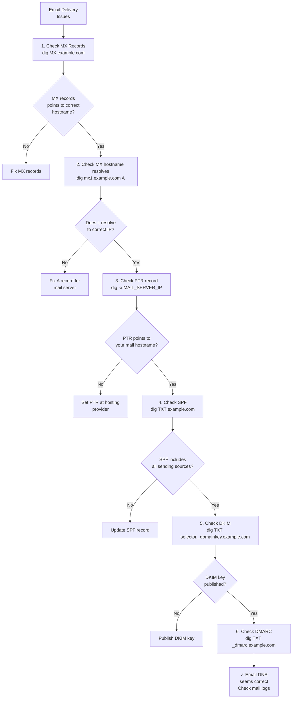

# Chapter 11: Debugging DNS — It's Always DNS

> *"What is it?"*
> *"DNS."*
> *"But I checked DNS."*
> *"Did you check DNS?"*
> *"...No."*
> — Every on-call conversation ever

---

## 11.1 The First Rule of Debugging

When something on the internet doesn't work, there are five possibilities:

1. It's DNS
2. It's DNS
3. It's DNS
4. It's actually a firewall (which is secretly also DNS-related)
5. It's genuinely something else (this is rare)

The IT world's universal meme captures this perfectly:

```
╔═══════════════════════════════════╗
║  WEBSITE IS DOWN                  ║
║                                   ║
║  Is it DNS?                       ║
║                                   ║
║  ┌──────────┐      ┌──────────┐   ║
║  │    YES   │      │    NO    │   ║
║  └────┬─────┘      └────┬─────┘   ║
║       │                 │         ║
║       ▼                 ▼         ║
║  It's DNS          Are you sure?  ║
║                         │         ║
║                         ▼         ║
║                    It's DNS       ║
╚═══════════════════════════════════╝
```

With that philosophical foundation established, let's learn to actually debug DNS.

---

## 11.2 Your Debugging Arsenal

These are the tools you need, in order of how often you'll use them:

### dig — The Swiss Army Knife

```bash
# Basic query
dig example.com

# Query specific record type
dig example.com MX
dig example.com TXT
dig example.com NS
dig example.com SOA

# Query specific nameserver
dig @8.8.8.8 example.com
dig @1.1.1.1 example.com
dig @ns1.example.com example.com  # Query authoritative directly

# Trace full resolution from root
dig +trace example.com

# Short output (just the answer)
dig +short example.com

# Show only the answer section
dig +noall +answer example.com

# Reverse DNS lookup
dig -x 93.184.216.34

# Check DNSSEC
dig +dnssec example.com

# Test using DoH
dig @https://cloudflare-dns.com/dns-query +https example.com
```

### nslookup — For When You're on Windows

```
> nslookup example.com
> nslookup example.com 8.8.8.8
> nslookup -type=MX example.com
> set type=TXT
> example.com
```

### host — Quick and Simple

```bash
host example.com              # A record
host -t MX example.com        # MX records
host -t TXT example.com       # TXT records
host 93.184.216.34            # Reverse lookup
```

### systemd-resolve — Modern Linux

```bash
systemd-resolve example.com
systemd-resolve --statistics   # Cache stats
systemd-resolve --flush-caches # Clear cache
systemd-resolve --status       # Show configured resolvers
```

---

## 11.3 The Step-by-Step DNS Debugging Guide

When DNS isn't working, follow this process:

### Step 1: Confirm DNS Is Actually the Problem

```bash
# Try connecting directly by IP to rule out DNS
curl --resolve example.com:443:93.184.216.34 https://example.com/

# If this works, DNS is the problem.
# If this fails too, it's not DNS (this time).
```

### Step 2: Can You Reach Any DNS Server?

```bash
# Try multiple public resolvers
ping 8.8.8.8        # Can you reach Google DNS?
ping 1.1.1.1        # Can you reach Cloudflare DNS?

dig @8.8.8.8 google.com +time=2  # Does Google DNS respond?
```

If you can't reach DNS servers at all, the problem is network connectivity, not DNS.

### Step 3: Query the Authoritative Nameserver Directly

This tells you what the **true** answer is, bypassing any caches:

```bash
# First, find the authoritative nameserver
dig example.com NS +short
# Output: ns1.example.com. ns2.example.com.

# Now query the authoritative server directly
dig @ns1.example.com www.example.com A
```

If the authoritative server returns the correct answer but regular queries don't, the problem is **caching** — and you just need to wait (or check your TTL situation).

### Step 4: Check the TTL

```bash
# Query and note the TTL
dig www.example.com A
# In the ANSWER SECTION, the number before "IN A" is the remaining TTL
# www.example.com.    3247    IN      A       93.184.216.34
#                     ^^^^
#                     3247 seconds = ~54 minutes remaining in cache
```

If you made a change and the TTL is still large, you need to wait.

### Step 5: Check for Propagation Inconsistency

```bash
# Query multiple resolvers and compare
for resolver in 8.8.8.8 1.1.1.1 9.9.9.9 208.67.222.222; do
    result=$(dig @$resolver +short www.example.com A)
    echo "$resolver: $result"
done
```

Different results from different resolvers = propagation in progress (expected). Same wrong result everywhere = problem at authoritative server.

### Step 6: Check the Full Chain

```bash
# Trace from root to answer
dig +trace www.example.com A

# Look for errors at each step
# A SERVFAIL or missing response indicates where the problem is
```

---

## 11.4 Interpreting dig Output

Let's decode a full `dig` output:

```
; <<>> DiG 9.16.1 <<>> www.example.com          ← Query info
;; global options: +cmd
;; Got answer:
;; ->>HEADER<<- opcode: QUERY, status: NOERROR, id: 51823
;;  ↑ status: NOERROR means success
;;  status: NXDOMAIN = not found
;;  status: SERVFAIL = server error
;;  status: REFUSED = server won't answer

;; flags: qr rd ra; QUERY: 1, ANSWER: 1, AUTHORITY: 0, ADDITIONAL: 1
;;        ↑↑ ↑↑ ↑↑
;;        |  |  └── ra = recursion available (server can recurse)
;;        |  └───── rd = recursion desired (we asked for recursion)
;;        └──────── qr = query response (this is a response, not a query)
;;
;; flags with ad = "authenticated data" (DNSSEC validated)
;; flags with aa = "authoritative answer" (answer from authoritative server)

;; QUESTION SECTION:
;www.example.com.               IN      A     ← What we asked for

;; ANSWER SECTION:
www.example.com.        3600    IN      A       93.184.216.34
;;                      ^^^^ TTL remaining

;; Query time: 23 msec                  ← How fast the response came
;; SERVER: 8.8.8.8#53(8.8.8.8)         ← Which server answered
;; WHEN: Mon Mar 24 10:00:00 UTC 2024   ← When the query was made
;; MSG SIZE  rcvd: 56                   ← Response size in bytes
```

---

## 11.5 Common DNS Error Scenarios and Their Solutions

### "NXDOMAIN" — Name Doesn't Exist

```bash
$ dig www.example.com
;; status: NXDOMAIN
```

Possible causes:
1. The record was never created → Create it
2. The record was deleted → Recreate it
3. You're querying the wrong zone → Check nameservers
4. Typo in the hostname → Check spelling
5. New record hasn't propagated yet → Wait (and check TTL)
6. Negative caching is in effect → Wait for negative TTL to expire

```bash
# Check if the zone itself exists
dig example.com SOA

# Check if the nameservers are correct
dig example.com NS

# Query authoritative directly
dig @$(dig +short example.com NS | head -1) www.example.com
```

### "SERVFAIL" — Server Failed

```bash
$ dig www.example.com
;; status: SERVFAIL
```

Possible causes:
1. **DNSSEC validation failure** — the record's signature doesn't match
2. **Authoritative nameserver is down** — can't get an answer
3. **Recursive resolver issue** — the resolver itself is broken
4. **Loop detection** — resolver detected a forwarding loop
5. **Timeout** — took too long to get an answer

```bash
# Check if it's DNSSEC
dig www.example.com +dnssec +cd    # +cd = checking disabled, bypass DNSSEC
# If this returns an answer but without +cd it fails = DNSSEC issue

# Check if authoritative is reachable
dig @ns1.example.com www.example.com

# Try a different resolver
dig @1.1.1.1 www.example.com
```

### "REFUSED" — Server Won't Answer

```bash
$ dig www.example.com @ns1.example.com
;; status: REFUSED
```

Possible causes:
1. ACL on the nameserver blocking your IP
2. Querying a recursive resolver that's configured to only answer for certain clients
3. The nameserver isn't authoritative for this zone and doesn't do recursion

Solution: Use a resolver you're allowed to use, or configure the nameserver's ACL.

### Slow DNS Responses

```bash
$ dig www.example.com
;; Query time: 3200 msec    ← 3.2 seconds! Something is very wrong
```

Possible causes:
1. **Resolver is far away** → Use a geographically closer resolver
2. **Cache miss + slow authoritative** → Problem with authoritative server
3. **DNSSEC overhead** → Large DNSSEC responses, many round trips
4. **Network issue** → Packet loss between resolver and nameserver
5. **Rate limiting** → You're being rate limited by a resolver or nameserver

```bash
# Compare latency from multiple resolvers
time dig @8.8.8.8 www.example.com +stats | grep "Query time"
time dig @1.1.1.1 www.example.com +stats | grep "Query time"
time dig @9.9.9.9 www.example.com +stats | grep "Query time"
```

---

## 11.6 Debugging Email DNS

Email DNS problems are their own category of pain. The sequence of checks:



---

## 11.7 The mxtoolbox Suite

For email DNS debugging, `mxtoolbox.com` is invaluable. It checks:
- MX records and whether the mail servers are reachable
- Blacklist status (is your IP blacklisted?)
- SPF record syntax and validity
- DKIM record existence
- DMARC record configuration
- Reverse DNS (PTR) records

Paste your domain in and prepare to be horrified at how many things are slightly misconfigured.

---

## 11.8 Packet Capture for DNS — Going Deep

When all else fails, capture the actual DNS packets:

```bash
# Capture DNS traffic on the default interface
sudo tcpdump -i any -n port 53

# Capture DNS and save to file
sudo tcpdump -i any -n port 53 -w /tmp/dns.pcap

# In Wireshark, filter for DNS:
# dns
# dns.qry.name contains "example.com"
# dns.flags.response == 1 and dns.flags.rcode != 0  (errors only)
```

Packet capture lets you see:
- Exactly what queries are being made
- Exactly what responses are being returned
- Whether responses have the correct TTLs
- Whether DNSSEC records are present
- Query/response timing

In Kubernetes:
```bash
# Capture on a specific pod's network namespace
POD=$(kubectl get pod my-pod -o jsonpath='{.metadata.uid}')
NODE=$(kubectl get pod my-pod -o jsonpath='{.spec.nodeName}')

# SSH to node and capture:
sudo tcpdump -i any -n port 53 and host $(kubectl get pod my-pod -o jsonpath='{.status.podIP}')
```

---

## 11.9 DNS Monitoring in Production

Don't wait for users to report DNS problems. Monitor it:

```yaml
# Prometheus DNS monitoring example (blackbox_exporter)
scrape_configs:
  - job_name: 'dns_probe'
    metrics_path: /probe
    params:
      module: [dns_tcp]
    static_configs:
      - targets:
        - 'example.com'
        - 'www.example.com'
        - 'api.example.com'
    relabel_configs:
      - source_labels: [__address__]
        target_label: __param_target
      - target_label: __address__
        replacement: blackbox-exporter:9115

# Alert on DNS failures
groups:
  - name: dns
    rules:
      - alert: DNSResolutionFailing
        expr: probe_success{job="dns_probe"} == 0
        for: 2m
        labels:
          severity: critical
        annotations:
          summary: "DNS resolution failing for {{ $labels.instance }}"
```

---

## 11.10 Post-Incident: Document Your DNS

After every DNS incident, document:
1. What failed (which record, from where)
2. Why it failed (root cause)
3. How long it took to detect
4. How long it took to fix
5. What the TTL was and how it affected blast radius
6. What monitoring would have caught this earlier

DNS incidents have a habit of repeating themselves. The only thing more frustrating than a DNS incident is the same DNS incident happening six months later because nobody documented the first one.

---

*Next: [Chapter 12 — Advanced DNS Topics: For the Truly Masochistic](12-advanced-dns.md)*
