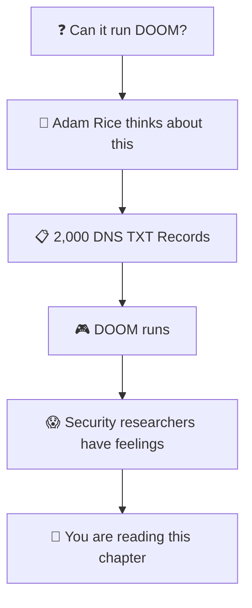
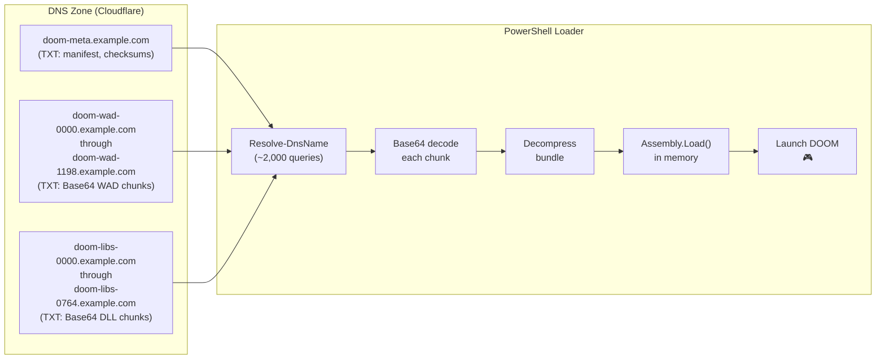
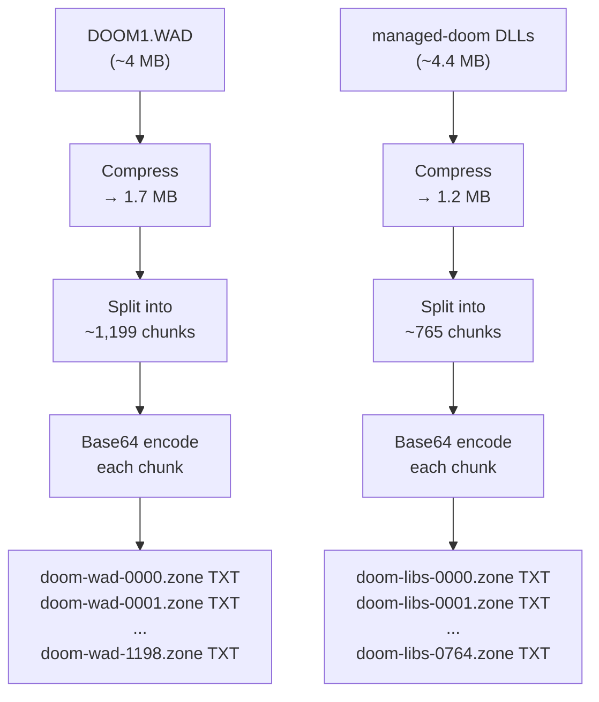
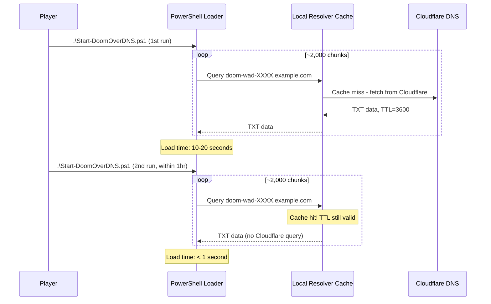
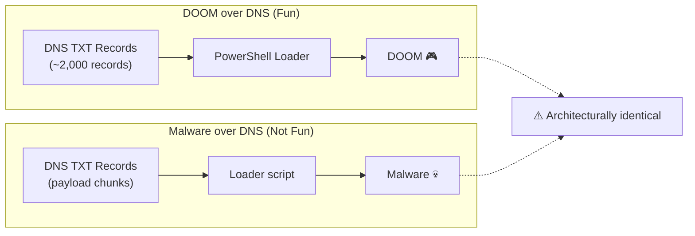
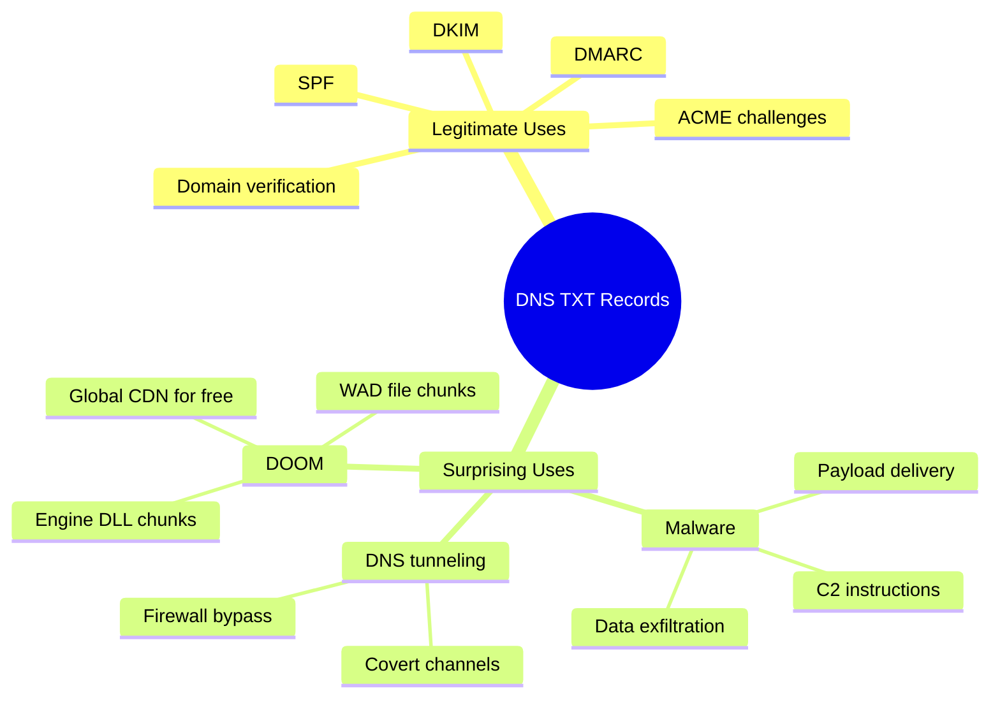

# Chapter 13: Running DOOM Over DNS — Because Of Course Someone Did This

> *"It's not a bug. It's a DNS feature."*

> *"Can it run DOOM?"*
> *"...it's a DNS server."*
> *"Can it run DOOM?"*
> — Adam Rice, presumably, to himself, at some point in early 2026

---

## 13.1 The Question That Must Always Be Asked

There is an ancient tradition in computing: whenever a new platform, protocol, or piece of infrastructure achieves critical mass, someone will ask the question. The question is always the same. The question is always answered in the affirmative, eventually.

**Can it run DOOM?**

DOOM has been run on:
- A pregnancy test
- A receipt printer
- An ATM
- A digital camera
- LEGO bricks
- A John Deere tractor display
- A MacBook's Touch Bar
- An oscilloscope

In March 2026, **Adam Rice** — security engineer, DNS enthusiast, and certified mad lad — added a new entry to this list:

**2,000 DNS TXT records.**

Not a server. Not a virtual machine. Not a container. DNS records. The same records your domain uses to publish its SPF policy. The same records that contain your Google site verification token. The same records that nobody ever looks at.

The title of his blog post says it all: **"Can it Resolve DOOM? Game Engine in 2,000 DNS Records."**

The answer, naturally, is yes.



---

## 13.2 The Insight: DNS TXT Records Are Just a Key-Value Store

The key insight behind DOOM over DNS is deceptively simple.

DNS TXT records hold arbitrary text. There's no validation of the *content* — the internet doesn't care if your TXT record says `"v=spf1 -all"` or `"aGVsbG8gd29ybGQ="` (which is `"hello world"` in Base64). Both are valid. Both will be served globally, cached at the edge, and returned to anyone who asks.

Cloudflare will serve your TXT records to the entire planet, with global anycast caching, for free. There's no authentication required to read them. No API key. No account. Just `dig`.

Adam Rice looked at this and thought: *if I can store arbitrary text, I can store Base64-encoded binary. If I can store Base64-encoded binary, I can store files. If I can store files, I can store a game.*

And so he did.

> **The TXT Record as a Free, Global, Serverless Key-Value Store:**
> DNS TXT records are globally distributed, cached at edge nodes worldwide, publicly queryable by anyone, free to read, and not meaningfully monitored by most organizations. They are, in effect, a free serverless database with no rate limits on reads and a global CDN built in. Nobody designed them this way. That's the point.

---

## 13.3 The Numbers

Let's talk about the numbers, because the numbers are glorious.

| Item | Original Size | After Compression |
|------|--------------|-------------------|
| DOOM1.WAD (shareware game data) | ~4 MB | ~1.7 MB |
| Managed-DOOM .NET DLL bundle | ~4.4 MB | ~1.2 MB |
| **Total** | **~8.4 MB** | **~2.9 MB** |

After compression, the entire shareware version of DOOM fits in approximately **1,964–1,966 DNS TXT records** across a single Cloudflare zone.

The loader (a PowerShell script) resolves all ~2,000 DNS queries in **10 to 20 seconds**, reassembles the data entirely in memory, loads the .NET assemblies via reflection, and launches the game.

Nothing is written to disk. DOOM materializes out of DNS queries and runs directly from RAM.



---

## 13.4 The Technical Architecture

### The Encoding Pipeline

Each file is processed as follows:

1. **Compress**: The WAD and DLL bundle are compressed (deflate/gzip)
2. **Split**: Compressed data is split into chunks that fit within DNS TXT record size limits
3. **Base64 encode**: Each chunk is Base64-encoded (DNS TXT records contain text, not binary)
4. **Name and upload**: Each chunk becomes a TXT record with a predictable naming scheme



### The Naming Convention

Chunks follow a predictable naming pattern so the loader knows exactly what to query:

```
<prefix>-<zero-padded-index>.<zone>

Examples:
doom-wad-0000.example.com     TXT  "H4sIAAAAAAAAA..."
doom-wad-0001.example.com     TXT  "H4sIAAAAAAAAA..."
doom-libs-0000.example.com    TXT  "H4sIAAAAAAAAA..."
```

A metadata record at the root tells the loader how many chunks to expect, their checksums, and what version of the data is present:

```
doom-meta.example.com    TXT  "wad-chunks=1199 lib-chunks=765 ..."
```

### Cloudflare Tier Limits

The maximum number of TXT records per Cloudflare zone varies by plan:

| Cloudflare Tier | Max DNS Records per Zone | Holds Entire Game? |
|----------------|--------------------------|-------------------|
| Free | 185 data chunks | No — need multiple zones |
| Pro | 3,400 data chunks | Yes ✓ |
| Business/Enterprise | 3,400 data chunks | Yes ✓ |

Free-tier users aren't blocked — the tooling supports **zone striping**: passing multiple domain names and distributing chunks across them. The loader knows which zone has which chunks and queries accordingly.

---

## 13.5 The Game Engine: managed-doom

You can't just take DOOM's WAD file and run it from DNS without a compatible engine. The standard DOOM engine expects files on disk. Adam Rice needed an engine that could load from memory buffers.

He chose **managed-doom** — a C# port of the original DOOM engine — and modified it:

| Original managed-doom | Modified version |
|----------------------|------------------|
| Native AOT compilation | Framework-dependent .NET 8 assemblies |
| Loads WAD from filesystem | Loads WAD from in-memory stream |
| Uses GLFW for windowing | Uses Win32 P/Invoke (no native dependencies) |
| Audio support | Audio disabled (`NullSound`, `NullMusic` stubs) |

The key change: **Native AOT** (Ahead-of-Time compilation) produces a single native binary — you can't load it dynamically at runtime. By switching to framework-dependent assemblies, the DLLs can be loaded into a running PowerShell session using `[System.Reflection.Assembly]::Load()` directly from a byte array fetched from DNS.

No DLL is ever written to disk. It loads, runs, and when you close DOOM, the memory is freed. It's as close to "DOOM as a pure DNS query" as you can get without teaching DNS to render pixels directly (and frankly, give it time).

---

## 13.6 The PowerShell Loader

The loader (`Start-DoomOverDNS.ps1`) is approximately 250 lines of PowerShell. It:

1. Queries the metadata record to discover the chunk counts
2. Fires off all chunk queries using `Resolve-DnsName`
3. Reassembles chunks in order
4. Base64-decodes the assembled data
5. Decompresses the bundle
6. Loads each DLL into the current PowerShell session via reflection
7. Invokes the DOOM entry point with the WAD data as a memory stream

```powershell
# Playing DOOM entirely from DNS in one command:
.\Start-DoomOverDNS.ps1 -PrimaryZone 'example.com'

# Override DNS server (bypass local cache):
.\Start-DoomOverDNS.ps1 -PrimaryZone 'example.com' -DnsServer '1.1.1.1'

# Play a specific game variant:
.\Start-DoomOverDNS.ps1 -PrimaryZone 'example.com' -WadName 'doom2'

# Pass arguments to the engine (start on level E1M3, Ultra-Violence):
.\Start-DoomOverDNS.ps1 -PrimaryZone 'example.com' -DoomArgs '-warp 1 3 -skill 4'
```

The script does the DNS resolution as fast as possible — Cloudflare's global CDN means the ~2,000 queries typically complete in **10 to 20 seconds**. By the time you've stood up to grab a coffee, DOOM is ready.

### The Upload Tooling

Publishing your own DOOM-over-DNS instance:

```powershell
# Step 1: Build the engine
cd managed-doom
dotnet publish ManagedDoom/ManagedDoom.csproj -c Release -f net8.0 -o publish-out

# Step 2: Configure Cloudflare credentials
Import-Module .\TXTRecords\TXTRecords.psm1
Set-CFCredential -ApiToken (Read-Host 'API Token' -AsSecureString)

# Step 3: Upload to DNS
.\Publish-DoomOverDNS.ps1 `
    -PublishDir 'managed-doom\publish-out' `
    -WadPath 'DOOM1.WAD' `
    -Zones @('example.com')
```

If the upload is interrupted (slow internet, API rate limiting, existential dread), the `-Resume` flag picks up where it left off:

```powershell
.\Publish-DoomOverDNS.ps1 -Resume -Zones @('example.com') ...
# Verifies checksums, finds the last good chunk, continues from there
```

---

## 13.7 The TTL Angle (Yes, TTL Is Still Here)

This is a book about DNS and TTL, so let's talk TTL.

When the loader fetches ~2,000 DNS TXT chunks, each chunk has a TTL. Cloudflare sets a minimum TTL of 60 seconds (or 0 on their proxy records). For the game data records, a reasonable TTL might be 3600 seconds or higher — the DOOM binary isn't changing frequently.

This means: **your first play-through fetches all 2,000 records. Your second play-through (within TTL) gets most of them from your local resolver's cache.**

If you're playing DOOM over DNS and your resolver has a 1-hour TTL cached, DOOM loads faster the second time. The more you play DOOM over DNS, the more efficiently DNS serves it to you.



**The implication:** DNS caching makes DOOM over DNS faster the more you play it. This is the most unexpected application of TTL optimization in the history of computing.

Also: if your DOOM-over-DNS records have a TTL of 86400 and you update the game engine, players with cached records will be running the old version for up to 24 hours. The classic TTL migration problem, but for a DOOM port. Classic.

---

## 13.8 The Security Implications — This Is Where It Gets Dark

Adam Rice is a security engineer, and he didn't build DOOM over DNS just for fun (well, mostly just for fun). The point — the sharp, uncomfortable point — is that **this technique is already used by real malware**.

In 2025, a piece of malware called **Joker Screenmate** was documented using exactly the same technique: encoding a payload in DNS TXT records, retrieving it at runtime, loading it into memory without touching disk.

The architectural difference between DOOM over DNS and a real C2 payload delivery mechanism: **none**.



The statistics are sobering:
- **Over 91% of malware** uses DNS at some stage of an attack
- **~60% of organisations** do not actively monitor their DNS traffic
- DNS TXT records are almost never inspected by firewalls or DLP systems
- The technique bypasses endpoint detection that looks for suspicious file writes (nothing is written to disk)
- Standard network monitoring that watches for large data transfers misses it (each DNS response is small; the total is only suspicious in aggregate)

### What Good DNS Security Looks Like

In light of DOOM over DNS, here's what defenders should be doing:

| Control | Why It Matters |
|---------|---------------|
| **Monitor DNS query volume per host** | A host making 2,000 DNS queries in 20 seconds to unusual domains is suspicious |
| **Alert on rare/new external DNS zones** | First query to a new zone should be logged and alertable |
| **Inspect TXT record content** | Large Base64 blobs in TXT records are a red flag |
| **DNS RPZ (Response Policy Zone)** | Block known malicious DNS zones |
| **DNS over TLS/HTTPS for egress** | At least make the traffic encrypted and attributable |
| **Baseline DNS behavior** | Know what normal DNS volume looks like per host so anomalies are visible |

> **The Defender's Meme:**
>
> *"We have a firewall."*
> *"It blocks port 80 and 443."*
> *"Does it inspect DNS TXT records for Base64-encoded executables?"*
> *"...it blocks port 80 and 443."*

---

## 13.9 How to Run It Yourself

> **⚠️ Note:** This requires a Cloudflare account, PowerShell 7+, .NET 8 SDK, and a legally obtained copy of DOOM1.WAD. The shareware version of DOOM1 was freely distributed by id Software, so obtaining it legally is straightforward. Don't be a demon. License your software.

**Prerequisites:**
```powershell
# Install PowerShell 7 (if not present)
winget install Microsoft.PowerShell

# Install .NET 8 SDK
winget install Microsoft.DotNet.SDK.8
```

**Playing someone else's published DOOM-over-DNS instance:**
```powershell
git clone https://github.com/resumex/doom-over-dns
cd doom-over-dns
.\Start-DoomOverDNS.ps1 -PrimaryZone 'example.com'
# (Replace example.com with an actual published zone)
```

**Publishing your own:**
```powershell
# Build the engine
cd managed-doom
dotnet publish ManagedDoom/ManagedDoom.csproj -c Release -f net8.0 -o publish-out
cd ..

# Configure credentials
Import-Module .\TXTRecords\TXTRecords.psm1
Set-CFCredential -ApiToken (Read-Host 'API Token' -AsSecureString)

# Upload DOOM to DNS
.\Publish-DoomOverDNS.ps1 `
    -PublishDir 'managed-doom\publish-out' `
    -WadPath 'path\to\DOOM1.WAD' `
    -Zones @('yourdomain.com')

# Wait 10-20 seconds after publishing for Cloudflare to propagate
# Then play:
.\Start-DoomOverDNS.ps1 -PrimaryZone 'yourdomain.com'
```

**Project repository:** [github.com/resumex/doom-over-dns](https://github.com/resumex/doom-over-dns)
**Original blog post:** [blog.rice.is/post/doom-over-dns](https://blog.rice.is/post/doom-over-dns)

---

## 13.10 The Broader Philosophy: DNS as an Unmonitored Transport

DOOM over DNS is funny. It is also a demonstration of a fundamental truth that security professionals have been trying to communicate for years:

**Any protocol that is allowed and unmonitored will be abused.**

DNS was designed to be fast, ubiquitous, and trusted. For 40 years, the default stance has been "DNS is infrastructure, not a threat surface." DOOM over DNS — followed immediately by "and by the way, malware does this too" — is a pedagogical masterpiece.

Adam Rice built a DOOM port. He also built an argument for DNS observability that no amount of slide decks could match.

The next time someone in a security review says "but it's just DNS" — remember that it was *just DNS* that loaded a complete 1993 first-person shooter into RAM without touching the filesystem, in 20 seconds, using publicly available infrastructure, for free.



---

## 13.11 The Punchline

We started this book with a DNS joke:

> "Guys, guys! I have a DNS joke for you! But be advised, it could take up to 24 hours for everyone to get it."

We're going to end this chapter with a better one:

> **"Can DNS run DOOM?"**
> **"It could take 10 to 20 seconds for it to resolve."**

And that is not a metaphor. That is literally what happens.

Adam Rice lowered the TTL on the entire premise of "DNS is just infrastructure" and propagated a patch: DNS is an attack surface, a covert channel, a distributed file system, and apparently, a gaming platform.

The update has propagated. Adjust your threat models accordingly.

---

## Sources and Further Reading

- [blog.rice.is — "Can it Resolve DOOM? Game Engine in 2,000 DNS Records"](https://blog.rice.is/post/doom-over-dns/)
- [github.com/resumex/doom-over-dns](https://github.com/resumex/doom-over-dns)
- [Tom's Hardware — "Mad lad stores and loads Doom from within DNS"](https://www.tomshardware.com/networking/mad-lad-stores-and-loads-doom-from-within-dns-txt-record-type-abused-to-store-game-data)
- [Hackster.io — "Adam Rice Proves Doom Really Can Run Anywhere"](https://www.hackster.io/news/adam-rice-proves-doom-really-can-run-anywhere-by-porting-it-to-dns-8cdf1c8f16b0.amp)
- [Hacker News discussion](https://news.ycombinator.com/item?id=47490705)
- [abit.ee — "DOOM over DNS: how an engineer ran a game through TXT records"](https://abit.ee/en/cybersecurity/doom-over-dns-dns-txt-records-dns-tunnelling-dns-security-cybersecurity-dns-malware-dns-delivery-en)

---

*[← Chapter 12 — Advanced DNS Topics](12-advanced-dns.md) | [Appendix A — Cheat Sheet →](appendix-a-cheatsheet.md)*
